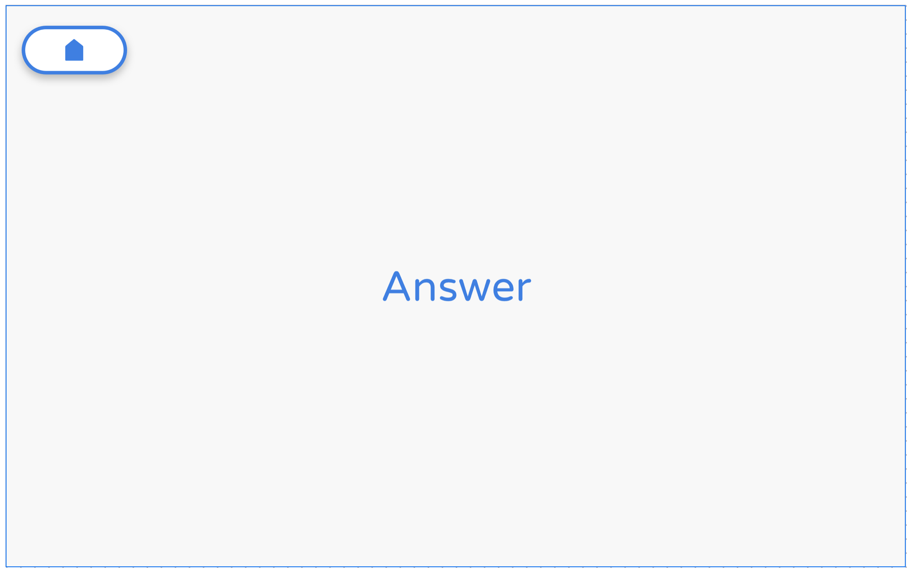
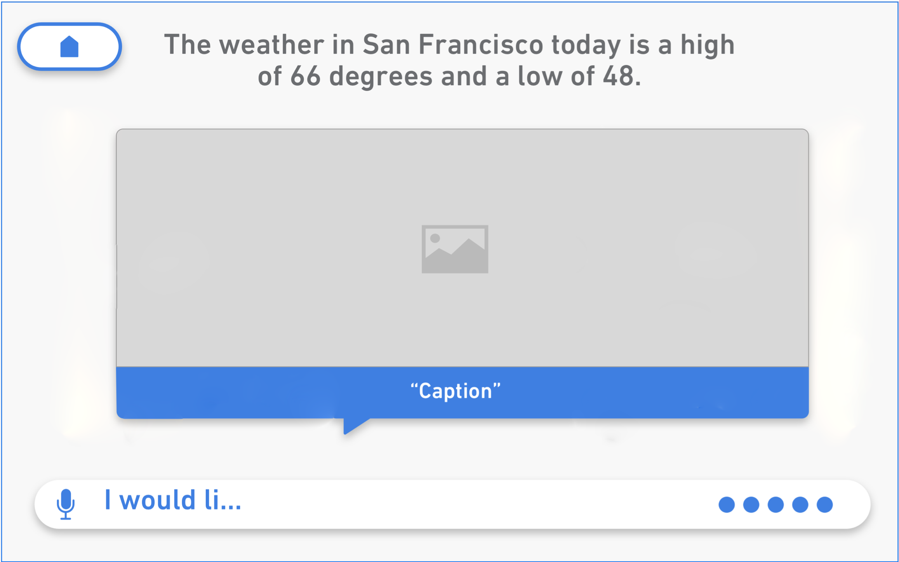
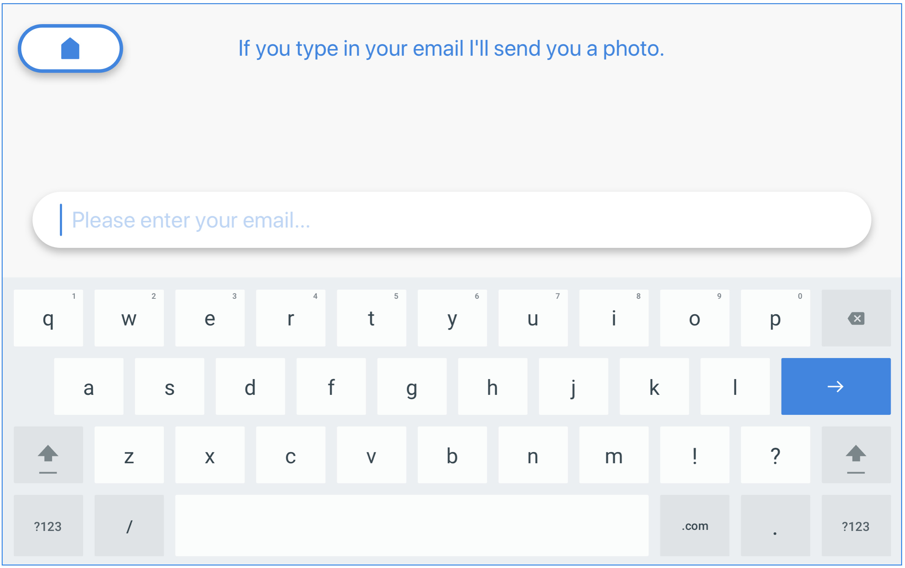

<aside type="info"> * NOTE: .MOVs do not display reliably on Pepper's tablet </aside>

```dialogflow
"""""""""""""""""""
Dialogflow:
""""""""""""""""""
I.) For each section, there is a UI and a Fulfillment section
      a.) UI - indicates the instruction set that follows is 
          relevant to the Dialogflow User Interface; 
      b.) FULFILLMENT - coming soon...
```

```ms_bot_framework
"""""""""""""""""""""""""""""""""""""""""
MS Bot Framework:
""""""""""""""""""""""""""""""""""""""""
I.) Our MS Bot Framework is limited in comparison to our Dialogflow integration. For a more robust experience, please use Dialogflow.
```


## TEXT ONLY

> TEXT ONLY RESPONSE:

Simple, non-selectable, text response

```dialogflow
"""""""""""""""""""""""""""""""""""""""""
Dialogflow:
""""""""""""""""""""""""""""""""""""""""
I.) UI:
For each intent within your agent, use the simple 'Text response'
fields under the 'Response' section to render a response. Input multiple
responses to have Pepper randomly choose between text responses. See 
'General Information' section above for information on how to have Pepper
display different text from what he speaks.

```




```ms_bot_framework
"""""""""""""""""""""""""""""""""""""""""
MS-Bot: Text Only response:
"""""""""""""""""""""""""""""""""""""""""
{
  "type": "message",
  "text": "Duh, German Shepard Puppies tell the best jokes!",
  "locale": "en-US",
  "localTimestamp": "2017-10-02T11:11:52-07:00",
  "from": {
    "id": "default-bot",
    "name": "Bot"
  },
  "recipient": {
    "id": "default-user"
  },
  "inputHint": "acceptingInput",
  "replyToId": "9hecj33gj8mckk1m3",
  "id": "48mj8inig8dmc9i39",
  "channelId": "emulator",
  "timestamp": "2017-10-02T18:11:52.982Z",
  "conversation": {
    "id": "mb6c0bcdl2eclij9i"
  }
}

"""""""""""""MAPPING""""""""""""""""""""
Mapping (MS-Bot -> Pepper Data Model):
text -> speak
text -> show.text

WHERE
-> = strictly mapped
""""""""""""""""""""""""""""""""""""""""
```


## TEXT BUBBLES


> TEXT BUBBLES RESPONSE: 

Selectable, Scrollable (1-4 max on tablet at a time) - variable size

```dialogflow
"""""""""""""""""""""""""""""""""""""""""
Dialogflow:
""""""""""""""""""""""""""""""""""""""""
I.) UI: 
There are two ways to display Text Bubbles within Dialogflow:
  A.) Google Assistant > Suggestion Cards:
    Under the 'Response' section:
      1) Click the + icon next to 'Default'
      2) Select 'Google Assistant'
      3) Under the 'Google Assistant' tab, select 'Add Message 
      Content'
      4) Select 'Suggestion Card'
      5) Input suggestions, which become Text Bubbles
  B.) Google Assistant > List:
    Under the 'Response' section:
      1) Click the + icon next to 'Default'
      2) Select 'Google Assistant'
      3) Under the 'Google Assistant' tab, select 'Add Message 
      Content'
      4) Select 'List'
      5) In the Title field, enter what you want Pepper to say 
      and display on its tablet according to the syntax described 
      above ^^ in the 'General Information':
      ({What Pepper Says} || {What Pepper displays})
      6) In the field that says 'Enter option key...', enter a 
      specific line of text that will trigger another custom 
      intent that you will need to create to receive the action
      7) Add more list items, which will become more Text Bubbles


```


```ms_bot_framework
"""""""""""""""""""""""""""""""""""""""""
MS-Bot: Hero Card with Choices
"""""""""""""""""""""""""""""""""""""""""
{
  "type": "message",
  "attachments": [{
    "contentType": "application/vnd.microsoft.card.hero",
    "content": {
      "title": "Do you want to know about Puppies?",
      "buttons": [{
          "type": "imBack",
          "value": "Yes please",
          "title": "Yes please"
        },
        {
          "type": "imBack",
          "value": "No thanks",
          "title": "No thanks"
        }
      ]
    }
  }],
  "locale": "en-US",
  "localTimestamp": "2017-10-02T10:45:19-07:00",
  "from": {
    "id": "n5dm5eb6ldekh6a3",
    "name": "Bot"
  },
  "recipient": {
    "id": "default-user"
  },
  "inputHint": "acceptingInput",
  "replyToId": "i0gn412d30ag423i",
  "id": "j2j8245c6b9m12n3i",
  "channelId": "emulator",
  "timestamp": "2017-10-02T17:45:19.923Z",
  "conversation": {
    "id": "6ja3le587mmjbc4c"
  }
}

"""""""""""""MAPPING""""""""""""""""""""
Mapping (MS-Bot Hero Card w/ Choices -> Pepper Data Model):
attachments.content.buttons ~> show.content
attachments.content.buttons.title -> show.content.text
attachments.content.buttons.value -> show.content.value
attachments.content.title -> show.text
attachments.content.title -> speak

WHERE
~> = loosely mapped
-> = strictly mapped
""""""""""""""""""""""""""""""""""""""""
```

## IMAGE - Carousel, Captioned

> ACTIONABLE IMAGES & TEXT RESPONSE:

Selectable, Scrollable (3 max on tablet at a time)

Dimensions: 360w x 341t ea.

```dialogflow
"""""""""""""""""""""""""""""""""""""""""
Dialogflow:
""""""""""""""""""""""""""""""""""""""""
I.) UI:
For a given intent within your agent, under the 'Response'
section:
1) Click the + icon next to 'Default'
2) Select 'Google Assistant'
3) Under the 'Google Assistant' tab, select 'Add Message Content'
4) Select 'List'
5) Enter the URL of the picture
6) In the Title field, enter what you want Pepper to say and display
on its tablet according to the syntax described above ^^ in the 
'General Information' ({What Pepper Says} || {What Pepper displays})
7) In the field that says 'Enter option key...', enter a specific 
line of text that will trigger another custom intent that you will 
need to create to receive the action
8) Add as many list items as you want displayed


```


```ms_bot_framework
"""""""""""""""""""""""""""""""""""""""""
MS-Bot: Hero Card with Images and Choices
"""""""""""""""""""""""""""""""""""""""""
{
  "type": "message",
  "attachmentLayout": "carousel",
  "attachments": [{
      "contentType": "application/vnd.microsoft.card.thumbnail",
      "content": {
        "title": "Boxer",
        "subtitle": "A breed of utility dog.",
        "text": "The American boxer is a stocky, well built, strong-looking dog, with a large head and a muscular build. Its coat is short and generally smooth. The breed is a light to moderate shedder.",
        "images": [{
          "url": "https://static.pexels.com/photos/158682/snow-dog-de-bordeaux-158682.jpeg"
        }],
        "buttons": [{
          "type": "imBack",
          "value": "boxer",
          "title": "Boxer"
        }]
      }
    },
    {
      "contentType": "application/vnd.microsoft.card.thumbnail",
      "content": {
        "title": "Akita",
        "subtitle": "Continental Toy Spaniel",
        "text": "The Akita is a very intelligent and self-assured dog that has a very easy time learning new tricks. This dog can be sociable with children and strangers but is generally reserved around new people. ",
        "images": [{
          "url": "https://upload.wikimedia.org/wikipedia/commons/5/56/Papillon_Ears.jpg"
        }],
        "buttons": [{
          "type": "imBack",
          "value": "akita",
          "title": "Akita"
        }]
      }
    }
  ],
  "locale": "en-US",
  "localTimestamp": "2017-10-02T10:45:24-07:00",
  "from": {
    "id": "n5dm5eb6ldekh6a3",
    "name": "Bot"
  },
  "recipient": {
    "id": "default-user"
  },
  "inputHint": "acceptingInput",
  "replyToId": "dn58c2bfjd1089dkac",
  "id": "nbdk7b69eb0j9j69",
  "channelId": "emulator",
  "timestamp": "2017-10-02T17:45:24.902Z",
  "conversation": {
    "id": "6ja3le587mmjbc4c"
  }
}

"""""""""""""MAPPING""""""""""""""""""""
Mapping (MS-Bot -> Pepper Data Model):
attachments ~> show.content
attachments.title -> show.content.text
attachments.subtitle -> **ABANDONED**
attachments.text -> show.content.speak
attachments.images.url -> show.content.contentURL
attachments.buttons.value -> show.content.value

ADDED
speak: 'Tap or Say one of the following'
show.content.text: 'Tap or Say one of the following'

WHERE
~> = loosely mapped
-> = strictly mapped
""""""""""""""""""""""""""""""""""""""""
```


## IMAGE - Carousel, Uncaptioned

> ACTIONABLE IMAGES & TEXT RESPONSE:

Selectable, Scrollable (3 max on tablet at a time)

Dimensions: 360w x 361t ea.

```dialogflow
"""""""""""""""""""""""""""""""""""""""""
Dialogflow: 
""""""""""""""""""""""""""""""""""""""""
For a given intent within your agent, under the 'Response'
section, select 'Custom Payload' and enter the following:
{
  "title": "Tap or Say one of the following",
  "imageCards": [
    {
      "speak": "The American boxer is a strong-looking dog.",
      "contentURL": "https://static.pexels.com/photos/158682/snow-dog-de-bordeaux-158682.jpeg",
      "value": "boxer"
    },
    {
      "speak": "Its coat is short and generally smooth.",
      "contentURL": "https://static.pexels.com/photos/158682/snow-dog-de-bordeaux-158682.jpeg",
      "value": "boxer"
    },
    {
      "speak": "The Akita is a very intelligent dog.",
      "contentURL": "https://upload.wikimedia.org/wikipedia/commons/5/56/Papillon_Ears.jpg",
      "value": "akita"
    },
    {
      "speak": "This dog can be sociable with children.",
      "contentURL": "https://upload.wikimedia.org/wikipedia/commons/5/56/Papillon_Ears.jpg",
      "value": "akita"
    }
  ]
}
```


```ms_bot_framework
"""""""""""""""""""""""""""""""""""""""""
MS-Bot: N/A
"""""""""""""""""""""""""""""""""""""""""
Not available in MS-Bot
```

## IMAGE - 1-6-Icon Layouts

> ACTIONABLE IMAGES & TEXT RESPONSE:

Selectable, Non-Scrollable, Multiple-Icon Layouts (6 max total)
Background image configurable

Dimensions: 280w x 225t ea.

```dialogflow
"""""""""""""""""""""""""""""""""""""""""
Dialogflow: 
""""""""""""""""""""""""""""""""""""""""
For a given intent within your agent, under the 'Response'
section, select 'Custom Payload' and enter the following:
{
  "backgroundColor": "#d7d7d7",
  "backgroundImage": "https://pepperstoragedev.blob.core.windows.net/pepperdrive/41092db5-ee34-424a-bdf3-6bca579180af60cd05b2-4caf-47e3-b654-e69da3b6f81a.jpg",
  "text": "Background color code and image together",
  "speak": "Color code and image test",
  "customIcons": [
    {
      "iconUrl": "https://pepperstoragedev.blob.core.windows.net/pepperdrive/41092db5-ee34-424a-bdf3-6bca579180af6c4dfe53-5fa2-45a2-a431-4cf014fc750e.png",
      "value": "One icon",
      "text": "Icon 1",
      "speak": "Good choice"
    },
    {
      "iconUrl": "https://pepperstoragedev.blob.core.windows.net/pepperdrive/41092db5-ee34-424a-bdf3-6bca579180afa013ade8-f8b1-4c69-914e-4c255274c84c.png",
      "value": "Two icons",
      "text": "Icon 2",
      "speak": "OK"
    },
    {
      "iconUrl": "https://pepperstoragedev.blob.core.windows.net/pepperdrive/41092db5-ee34-424a-bdf3-6bca579180afde0a0ee6-947d-4ca7-918c-a034e6e65350.png",
      "value": "Three icons",
      "text": "Icon 3",
      "speak": "You got it"
    },
    {
      "iconUrl": "https://pepperstoragedev.blob.core.windows.net/pepperdrive/41092db5-ee34-424a-bdf3-6bca579180af6e65cd8c-9e2a-4db4-b65c-107b4629c1a8.png",
      "value": "Four icons",
      "text": "Icon 4",
      "speak": "Alright"
    },
    {
      "iconUrl": "https://pepperstoragedev.blob.core.windows.net/pepperdrive/41092db5-ee34-424a-bdf3-6bca579180af969a089b-884b-47e2-b896-b2b9f07eea31.png",
      "value": "Five icons",
      "text": "Icon 5",
      "speak": "Great"
    },
    {
      "iconUrl": "https://pepperstoragedev.blob.core.windows.net/pepperdrive/41092db5-ee34-424a-bdf3-6bca579180afc611cb65-0926-4ccb-b308-4f879f131ec8.png",
      "value": "Six icons",
      "text": "Icon 6",
      "speak": "Wonderful"
    }
  ]
}
```


```ms_bot_framework
"""""""""""""""""""""""""""""""""""""""""
MS-Bot: N/A
"""""""""""""""""""""""""""""""""""""""""
Not available in MS-Bot
```


## IMAGE - Basic Card

> IMAGE RESPONSE - Basic Card

Non-selectable, must be followed by text bubbles to be selectable<br>

Dimensions: <br>
&#160;&#160;&#160;&#160;&#160;&#160;&#160;&#160;- approx. 975w x 585t for landscape Basic Cards<br>
&#160;&#160;&#160;&#160;&#160;&#160;&#160;&#160;- approx. 415w x 585t for portrait Basic Cards

```dialogflow
"""""""""""""""""""""""""""""""""""""""""""""""""""""""""""
Dialogflow: Non-actionable Images (with follow-up buttons)
""""""""""""""""""""""""""""""""""""""""""""""""""""""""""
I.) UI:
For a given intent within your agent, under the 'Response'
section:
1) Click the + icon next to 'Default'
2) Select 'Google Assistant'
3) Under the 'Google Assistant' tab, select 'Add Message Content'
4) Select 'Basic Card'
5) Enter the URL of the picture
6) In the 'Title' field, enter what you want Pepper to say and display
on its tablet according to the syntax described above ^^ in the 
'General Information' section: ({What Pepper Says} || {What Pepper displays})

Note: with non-actionable images, it is recommended to keep the conversation
alive with a follow-up message. To prompt the user for another action, 
simply combine the Basic Card with the Google Assistant Suggestion Chips.


```



```ms_bot_framework
"""""""""""""""""""""""""""""""""""""""""
MS-Bot: Image Attachments response:
"""""""""""""""""""""""""""""""""""""""""
{
  "type": "message",
  "attachments": [{
      "contentUrl": "http://www.greathillpartners.com/wp-content/uploads/Golden-Puppy.jpg",
      "contentType": "image/jpg",
      "name": "Puppy pic 1"
    },
    {
      "contentUrl": "https://i.ytimg.com/vi/VRiWE1l8KqI/maxresdefault.jpg",
      "contentType": "image/jpg",
      "name": "Puppy pic 2"
    },
    {
      "contentUrl": "http://24.media.tumblr.com/53e3171e750c6c1028f8200ad73c8a53/tumblr_mkozt0qp3B1qiwf8po1_500.jpg",
      "contentType": "image/jpg",
      "name": "Puppy pic 1"
    }
  ],
  "text": "Here are some puppies",
  "locale": "en-US",
  "localTimestamp": "2017-10-02T11:01:51-07:00",
  "from": {
    "id": "default-bot",
    "name": "Bot"
  },
  "recipient": {
    "id": "default-user"
  },
  "inputHint": "ignoringInput",
  "replyToId": "3j6714mfbl49hf1bac",
  "id": "688k3bd50e8ifk364c",
  "channelId": "emulator",
  "timestamp": "2017-10-02T18:01:51.235Z",
  "conversation": {
    "id": "efj6c25bj3e43b0c9"
  }
}

"""""""""""""MAPPING""""""""""""""""""""
Mapping (MS-Bot -> Pepper Data Model):
attachments ~> show.content
attachments.contentUrl-> show.content.contentURL
attachments.contentType-> show.content.contentType
text -> speak
text -> show.text

WHERE
~> = loosely mapped
-> = strictly mapped
""""""""""""""""""""""""""""""""""""""""
```


##  IMAGE - Fullscreen Image

> IMAGE RESPONSE - Fullscreen Image:

Selectable, Non-Scrollable - 1280w x 800t

```dialogflow
"""""""""""""""""""""""""""""""""""""""""
Dialogflow: 
""""""""""""""""""""""""""""""""""""""""
I.) UI:
A.) Selectable:
For a given intent within your agent, under the 'Response'
section, click 'Add Message Content', select 'Custom Payload' 
and copy and paste the following:
{
  "backgroundColor": "#d7d7d7",
  "backgroundImage": "https://pepperstoragedev.blob.core.windows.net/pepperdrive/c8f7061d-cd26-4807-8113-209cf7f574738baae0ca-27e1-4998-8732-7042c66e12ad.jpg",
  "speak": "Here is an actionable background image ||"
}
B.) Non-selectable:
{
  "imageURL": "https://pepperstoragedev.blob.core.windows.net/files/Default_Story_1.jpg",
  "speak": "Hi, I dont know how much you know about me, but I am here to be your host.",
  "delay": 2
}

Notes: 

A) With non-actionable images, it is recommended to keep the conversation
alive with a follow-up message. To prompt the user for another action, 
simply combine the Basic Card with the Google Assistant Suggestion Chips.

B) When using JSON (^^), any QiChat commands must be double-escaped (\\).


```


```ms_bot_framework
"""""""""""""""""""""""""""""""""""""""""
MS-Bot: Full Screen Image response:
""""""""""""""""""""""""""""""""""""""""

Not yet available in MS-Bot
```


## IMAGE - Sequence of Images

> IMAGE RESPONSE - Sequence of Images

```dialogflow
"""""""""""""""""""""""""""""""""""""""""
Dialogflow: IMAGE RESPONSE
""""""""""""""""""""""""""""""""""""""""
To create a non-actionable sequence of (full screen) images, use the
'Full Screen Image Response' described above. Chain the Custom
Payloads together, one after another, to create a story.
```


```ms_bot_framework
"""""""""""""""""""""""""""""""""""""""""
MS-Bot: Image Attachments response:
"""""""""""""""""""""""""""""""""""""""""
{
  "type": "message",
  "attachments": [{
      "contentUrl": "http://www.greathillpartners.com/wp-content/uploads/Golden-Puppy.jpg",
      "contentType": "image/jpg",
      "name": "Puppy pic 1"
    },
    {
      "contentUrl": "https://i.ytimg.com/vi/VRiWE1l8KqI/maxresdefault.jpg",
      "contentType": "image/jpg",
      "name": "Puppy pic 2"
    },
    {
      "contentUrl": "http://24.media.tumblr.com/53e3171e750c6c1028f8200ad73c8a53/tumblr_mkozt0qp3B1qiwf8po1_500.jpg",
      "contentType": "image/jpg",
      "name": "Puppy pic 1"
    }
  ],
  "text": "Here are some puppies",
  "locale": "en-US",
  "localTimestamp": "2017-10-02T11:01:51-07:00",
  "from": {
    "id": "default-bot",
    "name": "Bot"
  },
  "recipient": {
    "id": "default-user"
  },
  "inputHint": "ignoringInput",
  "replyToId": "3j6714mfbl49hf1bac",
  "id": "688k3bd50e8ifk364c",
  "channelId": "emulator",
  "timestamp": "2017-10-02T18:01:51.235Z",
  "conversation": {
    "id": "efj6c25bj3e43b0c9"
  }
}

"""""""""""""MAPPING""""""""""""""""""""
Mapping (MS-Bot -> Pepper Data Model):
attachments ~> show.content
attachments.contentUrl-> show.content.contentURL
attachments.contentType-> show.content.contentType
text -> speak
text -> show.text

WHERE
~> = loosely mapped
-> = strictly mapped
""""""""""""""""""""""""""""""""""""""""
```


##  VIDEO - Fullscreen Video

> VIDEO RESPONSE:

Skippable - 1280w x 800t - .mp4 format required
YouTube / Vimeo / etc. video links do not work

```dialogflow
"""""""""""""""""""""""""""""""""""""""""
Dialogflow: VIDEO RESPONSE
""""""""""""""""""""""""""""""""""""""""
I.) UI:
For a given intent within your agent, under the 'Response'
section, click 'Add Message Content', select 'Custom Payload'
and copy and paste the following:
{
  "videoURL": "https://url-of-your-video-file.mp4",
  "contentType": "video/mp4",
  "speak": "Here is a short video that is relevant to your utterance..."
}

Note: When using JSON (^^), any QiChat commands must be double-escaped (\\).

```


```ms_bot_framework
"""""""""""""""""""""""""""""""""""""""""
MS-Bot: Video Only response:
"""""""""""""""""""""""""""""""""""""""""
{
  "type": "message",
  "attachments": [{
    "contentUrl": "https://pepperstoragedev.blob.core.windows.net/pepperstories/b68b2247-f74a-4f6b-b3ad-3e7e66c1e600.mp4?decache=QLT1MXCSF1A9",
    "contentType": "video/mp4",
    "name": "Puppy video"
  }],
  "text": "Here is a puppy video",
  "locale": "en-US",
  "localTimestamp": "2017-10-02T11:09:03-07:00",
  "from": {
    "id": "default-bot",
    "name": "Bot"
  },
  "recipient": {
    "id": "default-user"
  },
  "inputHint": "acceptingInput",
  "replyToId": "f0igi03ln2f4fem94c",
  "id": "ek9im8g5df0e305bf",
  "channelId": "emulator",
  "timestamp": "2017-10-02T18:09:03.318Z",
  "conversation": {
    "id": "mb6c0bcdl2eclij9i"
  }
}

"""""""""""""MAPPING""""""""""""""""""""
Mapping (MS-Bot -> Pepper Data Model):
attachments ~> show.content
attachments.contentUrl-> show.content. contentURL
attachments.contentType-> show.content.contentType
text -> speak
text -> show.text

WHERE
~> = loosely mapped
-> = strictly mapped
""""""""""""""""""""""""""""""""""""""""
```


## WEBPAGE - Show Webpage

> WEBPAGE - SHOW WEBPAGE:


```dialogflow
"""""""""""""""""""""""""""""""""""""""""
Dialogflow: 
""""""""""""""""""""""""""""""""""""""""
I.) UI:
For a given intent within your agent, under the 'Response'
section, click 'Add Message Content', select 'Custom Payload'
and copy and paste the following:
{
  "speak": "Here is a webpage ||",
  "action": "showWebpage",
  "action_parameters": {
    "url": "https://www.theorganproject.net/promote-registration-individuals/",
    "onClose": "Web page closed"
  }
}

```


```ms_bot_framework
"""""""""""""""""""""""""""""""""""""""""
MS-Bot: Show a webpage
""""""""""""""""""""""""""""""""""""""""
Not yet available in MS-Bot
```


## USER INPUT - SHOW KEYBOARD

> USER INPUT - SHOW KEYBOARD:

```dialogflow
"""""""""""""""""""""""""""""""""""""""""
Dialogflow: 
""""""""""""""""""""""""""""""""""""""""
For a given intent within your agent, under the 'Response'
section, select 'Custom Payload' and enter the following:
{
  "speak": "Type your confirmation number using the keyboard."
  "action": "showKeyboard"
}
```



```ms_bot_framework
"""""""""""""""""""""""""""""""""""""""""
MS-Bot: Show Keyboard response:
""""""""""""""""""""""""""""""""""""""""

Not yet available in MS-Bot
```

##  USER INPUT - PRIVACY POLICY

> PRIVACY POLICY - Checkbox:

###CHECKBOX
Keyboard with checked box with Privacy Policy displayed (for CTA) - .PDF format only

```dialogflow
"""""""""""""""""""""""""""""""""""""""""
Dialogflow: PRIVACY POLICY - CHECKBOX
""""""""""""""""""""""""""""""""""""""""
I.) UI: 
For a given intent within your agent, under the 'Response'
section, click 'Add Message Content', select 'Custom Payload'
and copy and paste the following:
{
  "speak": "Please type in your email and agree to our privacy policy to continue",
  "privacyPolicy": {
    "url": "https://pepperstoragedev.blob.core.windows.net/pepperdrive/41092db5-ee34-424a-bdf3-6bca579180afprivacy-policy-template.pdf",
    "inputType": "email",
    "checkBoxChecked": true
  }
}

Note: With non-actionable images, it is recommended to keep the conversation
alive with a follow-up message. To prompt the user for another action, 
simply combine the Basic Card with the Google Assistant Suggestion Chips.

```


```ms_bot_framework
"""""""""""""""""""""""""""""""""""""""""
MS-Bot: PRIVACY POLICY
""""""""""""""""""""""""""""""""""""""""
Not yet available in MS-Bot
```

###MODAL DIALOG POP-UP

> PRIVACY POLICY - Modal Dialog Pop-Up:

Modal window pops up with Privacy Policy displayed (for CTA) - .PDF format only

```dialogflow
"""""""""""""""""""""""""""""""""""""""""
Dialogflow: PRIVACY POLICY - Modal Dialog Pop-up
""""""""""""""""""""""""""""""""""""""""
I.) UI:
For a given intent within your agent, under the 'Response'
section, click 'Add Message Content', select 'Custom Payload'
and copy and paste the following:
{
  "speak": "Please enter your email",
  "privacyPolicy": {
    "url": "https://pepperstoragedev.blob.core.windows.net/pepperdrive/41092db5-ee34-424a-bdf3-6bca579180afprivacy-policy-template.pdf",
    "inputType": "email",
    "forcedPopup": true
  }
}

Note: With non-actionable images, it is recommended to keep the conversation
alive with a follow-up message. To prompt the user for another action, 
simply combine the Basic Card with the Google Assistant Suggestion Chips.

```


```ms_bot_framework
"""""""""""""""""""""""""""""""""""""""""
MS-Bot: PRIVACY POLICY
""""""""""""""""""""""""""""""""""""""""
Not yet available in MS-Bot
```

## TABLET UI SETTINGS

> TABLET UI SETTINGS - UPDATE CHATBOT STYLE

Configures style and settings for the chatbot's UI.

###UPDATE CHATBOT STYLE

```dialogflow
"""""""""""""""""""""""""""""""""""""""""
Dialogflow:  UPDATE CHATBOT STYLE
""""""""""""""""""""""""""""""""""""""""
I.) UI: 
For a given intent within your agent, under the 'Response'
section, select 'Custom Payload' and enter the following:
{
  "speak": "Setting background image and color ||",
  "action": "setStyle",
  "action_parameters": {
    "backgroundColor": "#ebc6eb",
    "backgroundImage": "https://pepperstoragedev.blob.core.windows.net/pepperdrive/41092db5-ee34-424a-bdf3-6bca579180afbd2dcbc8-f435-4615-b63c-4274d66d7993.png",
    "restoreDefault": false,
    "nextUtterance": "Start"
  }
}

Notes:
- Set "restoreDefault" to true to restore the original (default)
 chatbot screen style. "backgroundColor" and "backgroundImage" 
 parameters can be omitted in this case (ignored if present).
"speak" parameter is optional. 
- Use it if you want Pepper to say something when chatbot style 
is updated.
- "nextUtterance" parameter is also optional. You can trigger 
next chatbot intent automatically after changing the style by 
assigning one of intent phrases to this parameter.
- Use "default" as "backgroundColor"or "backgroundImage" value 
to restore the original state of corresponding parameter
- Use "none" as "backgroundImage" to remove the image
- Style changes persist till the end of chatbot session. Original 
chatbot style is restored every time chatbot session is restarted.

```


```ms_bot_framework
"""""""""""""""""""""""""""""""""""""""""
MS-Bot: UPDATE CHATBOT STYLE
""""""""""""""""""""""""""""""""""""""""

Not yet available in MS-Bot
```


###BACKGROUND - SET COLOR

```dialogflow
"""""""""""""""""""""""""""""""""""""""""
Dialogflow:  SET BACKGROUND COLOR
""""""""""""""""""""""""""""""""""""""""
I.) UI: 
For a given intent within your agent, under the 'Response'
section, select 'Custom Payload' and enter the following:
{
  "backgroundColor": "#d7d7d7",
  "speak": "Here is a background color ||"
}

```


```ms_bot_framework
"""""""""""""""""""""""""""""""""""""""""
MS-Bot: SET BACKGROUND COLOR
""""""""""""""""""""""""""""""""""""""""

Not yet available in MS-Bot
```

### BACKGROUND - SET IMAGE

```dialogflow
"""""""""""""""""""""""""""""""""""""""""
Dialogflow:  SET BACKGROUND IMAGE
""""""""""""""""""""""""""""""""""""""""
I.) UI: 
For a given intent within your agent, under the 'Response'
section, select 'Custom Payload' and enter the following:
{
  "backgroundColor": "#d7d7d7",
  "backgroundImage": "https://pepperstoragedev.blob.core.windows.net/pepperdrive/c8f7061d-cd26-4807-8113-209cf7f574738baae0ca-27e1-4998-8732-7042c66e12ad.jpg",
  "speak": "Here is an actionable background image ||"
}

```


```ms_bot_framework
"""""""""""""""""""""""""""""""""""""""""
MS-Bot: SET BACKGROUND IMAGE
""""""""""""""""""""""""""""""""""""""""

Not yet available in MS-Bot
```


# → Actions

The section below shows all the various actions that can be performed within a Chatbot context:


###ACTIONS - PRIMARY:
<ul>
  <li><a href="https://softbankroboticstraining.github.io/pepper-chatbot-api/#actions-run-application">RUN APPLICATION</a> - Launches external application - maintains chatbot session persistence</li>
  <li><a href="https://softbankroboticstraining.github.io/pepper-chatbot-api/#actions-play-a-game">PLAY A GAME</a> - Play a pre-installed game.</li>
  <li><a href="https://softbankroboticstraining.github.io/pepper-chatbot-api/#actions-trigger-an-intent">TRIGGER AN INTENT</a> - Provide an utterance to an intent you want to trigger </li>
</ul>

###ACTIONS - MISCELLANEOUS
<ul>
  <li><a href="https://softbankroboticstraining.github.io/pepper-chatbot-api/#actions-switch-language">SET LANGUAGE</a>
  Change the language Pepper is using</li>
  <li><a href="https://softbankroboticstraining.github.io/pepper-chatbot-api/#actions-get-robot-location">GET LOCATION</a>
  Returns geo-location of robot</li>
  
</ul>

## ACTIONS - RUN APPLICATION

> ACTIONS - RUN APPLICATION

Launches external application - maintains chatbot session persistence


```dialogflow
"""""""""""""""""""""""""""""""""""""""""
Dialogflow: RUN AN APPLICATION
""""""""""""""""""""""""""""""""""""""""
For a given intent within your agent, under the 'Response'
section, select 'Custom Payload' and enter the following:
{
  "speak": "Launching Survey application",
  "action": "startApp",
  "action_parameters": {
    "appId": "pepper-survey/."
  }
}

```


```ms_bot_framework
"""""""""""""""""""""""""""""""""""""""""
MS-Bot: RUN APPLICATION
""""""""""""""""""""""""""""""""""""""""
Not yet available in MS-Bot
```


## ACTIONS - PLAY A GAME

> ACTIONS - PLAY A GAME:

```dialogflow
"""""""""""""""""""""""""""""""""""""""""
Dialogflow: PLAY A GAME
""""""""""""""""""""""""""""""""""""""""
I.) UI:
  A.) To initiate a specific game, under the 'Response' section, 
  select 'Custom Payload' and enter the following:
  {
    "speak": "Initiating selfie mode."
    "action": "playGame",
    "action_parameters": {
      "gameName": "Take a Selfie"
    }
  }

    Current Game Options:
    - 'Mindfulness Minute'
    - 'Freestyle dance'
    - 'Take a Selfie'
    - 'Music Boxes'
    - 'Arcadia dance' - CURRENTLY UNAVAILABLE

  B.) To initiate a random game, under the 'Response' section, 
  select 'Custom Payload' and enter the following:
  { 
    "payloadType": "action",
    "action": "playRandomGame"
  }

```


```ms_bot_framework
"""""""""""""""""""""""""""""""""""""""""
MS-Bot: Play a Game response:
""""""""""""""""""""""""""""""""""""""""

Not yet available in MS-Bot
```


## ACTIONS - TRIGGER AN INTENT

> ACTIONS - TRIGGER AN INTENT

Provide an utterance to an intent you want to trigger

```dialogflow
"""""""""""""""""""""""""""""""""""""""""
Dialogflow:  TRIGGER AN INTENT
""""""""""""""""""""""""""""""""""""""""
I.) UI: 
For a given intent within your agent, under the 'Response'
section, select 'Custom Payload' and enter the following:
{
  "speak": "Setting background image and color ||",
  "action": "setStyle",
  "action_parameters": {
    "backgroundColor": "#ebc6eb",
    "backgroundImage": "https://pepperstoragedev.blob.core.windows.net/pepperdrive/41092db5-ee34-424a-bdf3-6bca579180afbd2dcbc8-f435-4615-b63c-4274d66d7993.png",
    "restoreDefault": false,
    "nextUtterance": "Start"
  }
}

```


```ms_bot_framework
"""""""""""""""""""""""""""""""""""""""""
MS-Bot: TRIGGER AN INTENT
""""""""""""""""""""""""""""""""""""""""

Not yet available in MS-Bot
```

## ACTIONS - SWITCH LANGUAGE

> ACTIONS - SWITCH LANGUAGE

Changes the language Pepper is using. 

<aside type='info'>NOTE: Requires that you have a multilingual Dialogflow agent. Also note that this will change the language for the entire communication system involving Pepper.  This includes Pepper's language, the transcription service language, and the Dialogflow agent.  </aside>

```dialogflow
"""""""""""""""""""""""""""""""""""""""""
Dialogflow:  SWITCH THE LANGUAGE
""""""""""""""""""""""""""""""""""""""""
I.) UI: 
By setting the 'style' payload, you can use the 'nextUtterance' feature to trigger a new intent. For a given intent within your agent, under the 'Response' section, select 'Custom Payload' and enter the following:
{
  "speak": "Setting background image and color ||",
  "action": "setStyle",
  "action_parameters": {
    "backgroundColor": "#ebc6eb",
    "backgroundImage": "https://pepperstoragedev.blob.core.windows.net/pepperdrive/41092db5-ee34-424a-bdf3-6bca579180afbd2dcbc8-f435-4615-b63c-4274d66d7993.png",
    "restoreDefault": false,
    "nextUtterance": "Start"
  }
}

```


```ms_bot_framework
"""""""""""""""""""""""""""""""""""""""""
MS-Bot: SWITCH THE LANGUAGE
""""""""""""""""""""""""""""""""""""""""

Not yet available in MS-Bot
```


## ACTIONS - GET ROBOT LOCATION

> ACTIONS - GET ROBOT LOCATION

Returns geo-location of robot

```dialogflow
"""""""""""""""""""""""""""""""""""""""""
Dialogflow:  GET ROBOT LOCATION
""""""""""""""""""""""""""""""""""""""""
I.) UI: 
For a given intent within your agent, under the 'Response'
section, select 'Custom Payload' and enter the following:
{
  "speak": "Getting triangulated geolocation information ||",
  "action": "getLocation"
}

```


```ms_bot_framework
"""""""""""""""""""""""""""""""""""""""""
MS-Bot: GET ROBOT LOCATION
""""""""""""""""""""""""""""""""""""""""

Not yet available in MS-Bot
