# Pepper Chat
##A Conversational UX Humanoid Robot Platform
```dialogflow
"""""""""""""""""""""""""""""""""""""""""""""""""""""""""""""""""""""
DialogFlow (previously API.AI) is a popular chatbot platform. It's 
also Google's entry into the conversational agency space. Before 
Google acquired API.AI (and subsequently renamed it to Dialogflow), 
it was used primarily to allow developers to create voice interfaces 
for applications. Choose Dialogflow as an interface for Pepper to 
unlock your robot's latent conversational abilities.

To see a working example:
(1) Download the example .zip file here: 
https://github.com/SoftBankRoboticsTraining/pepper-dialogflow-chatbot-faq
(2) Create a free account at www.dialogflow.com;
(3) Create a new agent;
(4) Click the gear icon to access the agent's settings; 
(5) Select the 'Export and Import' tab;
(5) Upload the .zip file from Step 1.

For a quick tutorial: 
  → www.youtube.com/watch?v=B8PrcwENCJg
For the full eLearning course: 
  → https://www.udemy.com/learn-conversational-ux-on-pepper-the-robot/

"""""""""""""""""""""""""""""""""""""""""""""""""""""""""""""""""""""
```


Welcome to the Pepper Chat platform! This technical reference is for Pepper owners running the Pepper-As-A-Host solution, who would like to connect their Pepper to a 3rd party chatbot (Dialogflow & MS Bot Framework platforms supported) in order to unlock Pepper's latent conversational abilities. It is an exciting evolution of Pepper's repertoire of capabilities. 

Given the overwhelming success of the "chatbot feature" of the Host product, which was historically an optional upgrade that would replace the standard "FAQ" feature of the Host product, SBRA decided to build out and open up the Pepper Chat platform to its broader customer base. Pepper Chat allows customers who want to take more control over Pepper's speech, animations, tablet display and overall interactions can now do so using this solution, all with a conversational-focused, web-based, user interface. Teaming up with Google and Microsoft to bring our customers world-class NLP and Conversational AI technologies, we are proud and excited to provide our customers with a conversation-based Pepper platform that is dynamic, smart, and immersively fun!

NAVIGATING THIS REFERENCE:
You can view general integration instructions in this central, light blue section. In the dark area to the right, you can see chatbot-specific code examples corresponding visually in line with each general section. Switch between different chatbot-specific code examples with the tabs in the top right.

```ms_bot_framework
"""""""""""""""""""""""""""""""""""""""""""""""""""""""""""""""""""""
The Microsoft Bot Framework facilitates the creation of 
powerful chatbots to enhance your application's capabilities. Its open 
source Bot Builder SDKs allow users to build simple to sophisticated 
dialogs. Cognitive Services enable your bot to interpret and interact 
in more human ways. The MS Bot Framework is one of the two 3rd-party 
chatbot integrations that Pepper for Host currently supports.

To see a working example, download the emulator here:
    https://docs.microsoft.com/en-us/bot-framework/bot-service-debug-emulator
and use the following sample PuppyBot information to set up your emulator:

MS Bot Endpoint:
   https://pepper-msbot.azurewebsites.net/api/messages?code=e3fa60oaOlabQUptT63DYSWPxrdG0pS9zFrADLT1xX9iGx6FxAG7pw==

PuppyBot App Id:
   808ad83e-3876-40fd-b0e8-a616e014fc6f

PuppyBot Password:
   9nHp8QNcwQJcNDHHjBCnoj7

PuppyBot LUIS Endpoint:
   https://westus.api.cognitive.microsoft.com/luis/v2.0/apps/4e4b1c46-5d6d-4035-9905-eef921df734f?subscription-key=37e463e0ae22427abc606d076dafbdd3&timezoneOffset=-480&verbose=true&spellCheck=true&q=

For the PuppyBot's source code and a list of sample utterances to ask 
the bot, navigate to our GitHub repo:
   https://github.com/SoftBankRoboticsTraining/msbot-puppy-bot/
"""""""""""""""""""""""""""""""""""""""""""""""""""""""""""""""""""""
```

<aside class="notice">We currently only support integrations with Microsoft's <a href="https://dev.botframework.com/"> Bot Framework</a> and Google's <a href="https://dialogflow.com/">Dialogflow</a>, but this list is quickly growing, so check back soon or else get in touch with us directly if your chatbot platform of choice does not appear on this list!</aside>

# Getting Started

> SBRA offers professional services to assist in the creation of your Chatbot. If you are interested, please email sales_us@softbankrobotics.com. Otherwise you can use the remainder of this documentation to create your own Chatbot for Pepper.

Building a successful chatbot for deployment on Pepper requires a large amount of time, patience, and cross-disciplinary creative expertise. For this reason, SBRA offers professional services to assist in the creation of your Chatbot for Pepper. If you are interested, <a href="mailto:sales_us@softbankrobotics.com">send us an email</a>. 

If you would like to learn and build on your own, you can take our free, <a href="https://www.udemy.com/learn-conversational-ux-on-pepper-the-robot/">2.5-hour, eLearning course on Udemy course</a> and use this documentation to get started.

# Authentication & Setup


```ms_bot_framework
"""""""""""""""""""""""""""""""""""""""""""""""""""""""""""""""""""""""""
MS BOT FRAMEWORK SETUP INSTRUCTIONS:
For MS bots, setup consists of providing us with one of your bot's 
DirectLine 'Secret Keys'. Provide this key to the SBR Sales Engineer 
assisting you with setup. You can find it by following these steps:

Step 1: Open your bot in Azure portal (https://portal.azure.com).
Step 2: Select the CHANNELS tab.
Step 3: Add DirectLine to your bot.
Step 4: Click on Edit.
Step 5: Copy one of the Secret Keys that was generated.
Step 6: Give the copied value to the SBR Sales Engineer.
"""""""""""""""""""""""""""""""""""""""""""""""""""""""""""""""""""""""""
```

```dialogflow
"""""""""""""""""""""""""""""""""""""""""""""""""""""""""""""""""""""""""
DIALOGFLOW SETUP INSTRUCTIONS:
For Dialogflow bots, setup varies based on which agent version your bot is. 
For V1 agents, setup consists of providing us with your Client Access Token. 
You can find your Client Access Token by following the below steps.

V1 Instructions: 
Step 1: Open your bot in Dialogflow (https://console.dialogflow.com/)
Step 2: Click on the gear icon to the right of your selected agent.
Step 3: Under the General tab (default), copy the Client Access Token value.
Step 3-b (optional): If you want to provide the Pepper Chat CMS the ability 
to edit your agent, you can also copy the Developer Access Token value.
Step 4: [Input token into Pepper Chat → See central panel for instructions]

For V2 agents, setup consists of providing us with your keypath file.

V2 Instructions:
Follow the instructions here to download your keypath file:
    → https://dialogflow.com/docs/reference/v2-auth-setup


↓ !IMPORTANT! ↓ 

AGENT SETUP INSTRUCTIONS:
To set up a welcome intent on Pepper in your agent, reconfigure the default 
Welcome Intent or else set up a new intent with the text 'init1234' as the 
only Training Phrase. You may use any type of response from the options 
below for your welcome intent's response. 
"""""""""""""""""""""""""""""""""""""""""""""""""""""""""""""""""""""""""
```

ChatBots use RESTful APIs with some form of credentials (typically KEY FILES, ACCESS TOKENS, APP IDs, PASSWORDS, etc.) to authenticate in order to send and retrieve text & multimedia session data. 

With SoftBank Robotics America's new Pepper ChatBot API and the Pepper Chat platform built on top of it, connecting your <a href="www.dialogflow.com">Dialogflow</a> or <a href="https://dev.botframework.com/">Microsoft Bot Framework</a> chatbot is as easy as it possibly can be. Simply log in to <a href="https://pepper-chat.azurewebsites.net">Pepper Chat CMS</a> (Content Management System) and provide the platform with a friendly name for your bot and either your bot's client access token or else a key file.

I.) CHATBOT INSTRUCTIONS:
<br>
→ SEE CHATBOT-SPECIFIC SETUP INSTRUCTIONS TO THE RIGHT → 
<br>

II.) PEPPER CHAT INSTRUCTIONS: 
<br>
1) Using your existing Host credentials, log in to the <a href="https://pepper-chat.azurewebsites.net">Pepper Chat CMS</a>
<br>
2) Add a new chatbot to your account from within the CHATBOTS tab, using the '+ Add Chatbot' button; 
<br>
3) Complete the setup wizard, supplying either the token or the keypath file you obtained from part I.

<aside class="info">V1 requires a Client Token to authenticate: </aside>
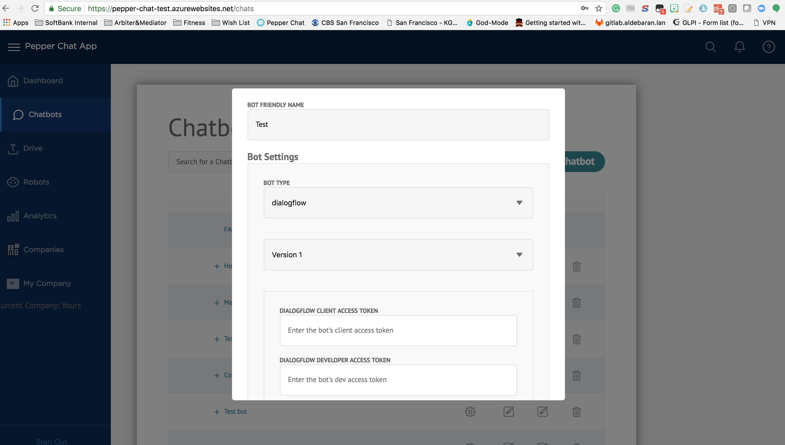

<aside class="info">V2 requires a KeyPath file to authenticate:</aside>
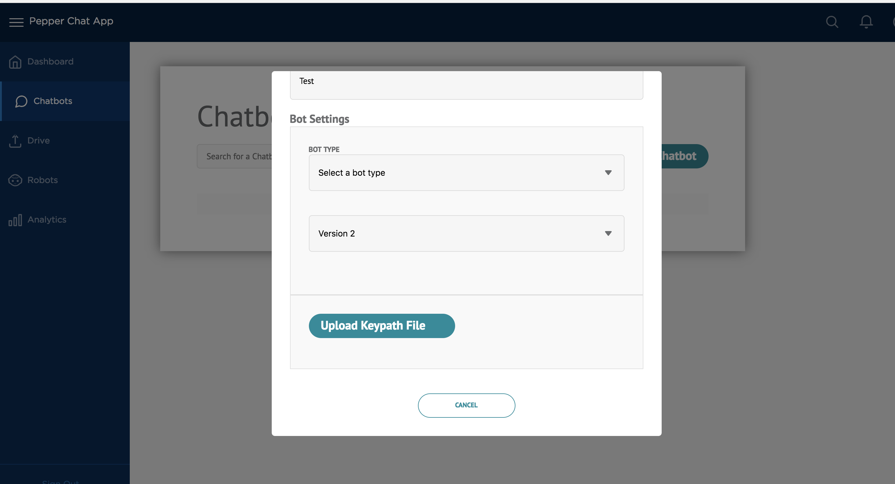

<aside class="info">NOTE: In order to have your Pepper launch directly into your chatbot, you will need to disable all other features in Host except for the FAQ. This will give launch priority directly to your chatbot! </aside>
<br>

<aside class="warning"> WARNING: The Pepper Chat platform is still in beta (testing/active development). There may be occasional bugs that you discover in the platform that will require patience until we can resolve them. Please <a href="mailto:ccnamlam@softbankrobotics.com">let us know</a> if you discover a bug.</aside>

# BUILD YOUR CHATBOT:

Now it's time to build your Pepper chatbot! Remember these guidelines in order to create a positive, memorable experience with Pepper for your customers.

1.) Use tablet menus throughout the conversation - it's easy for a user to get lost in a conversational UX experience <br>
2.) Let Pepper lead the conversation - Pepper always asks the follow-ups <br>
3.) Don't let a user dead-end - it's always better to have your ending conversational branches loop back around to an entry point into another conversational branch <br>
4.) Make the conversation truly interactive - Pepper can learn bits of information from the user and use them in the conversation<br>
5.) Make it fun and light - give Pepper a sense of humor and keep the conversation moving

# → Types of Responses

A Chatbot is essentially a collection of responses that are designed to be triggered by vocal- or text-based, user input.  With the Host + Pepper Chat platform, you can choose from the following type of responses that include both what Pepper speaks as well as renders on his tablet.

## SPEECH + TABLET DISPLAY OPTIONS:

> SPEECH + TABLET DISPLAY OPTIONS:

The section below shows all the various options that can be displayed on Pepper's tablet:

###TEXT:
<ul>
  <li><a href="https://softbankroboticstraining.github.io/pepper-chatbot-api/#text-only">TEXT (ONLY)</a> - Non-selectable text response; Pepper says the text as well as rendering the text on its tablet</li>
  <li><a href="https://softbankroboticstraining.github.io/pepper-chatbot-api/#text-bubbles">TEXT BUBBLES</a> - Selectable, Scrollable Text Bubbles(1-4 max on tablet at a time) - size of bubble varies according to the length of the response</li>
</ul>
###IMAGES:
<ul>
  <li><a href="https://softbankroboticstraining.github.io/pepper-chatbot-api/#image-carousel-captioned">IMAGES - Carousel, Captioned</a> - Selectable, Scrollable (n>2; 3 max on tablet at a time) - 360w x 341t ea.</li>
  <li><a href="https://softbankroboticstraining.github.io/pepper-chatbot-api/#image-carousel-uncaptioned">IMAGES - Carousel, Uncaptioned</a> - Selectable, Scrollable (n>2; 3 max on tablet at a time) - 360w x 341t ea.</li>
  <li><a href="https://softbankroboticstraining.github.io/pepper-chatbot-api/#image-1-6-icon-layouts">IMAGE(S) - 1-6-Icon Layouts</a> - Selectable, Non-Scrollable (1-6 max total) - 280w x 225t ea.</li>
  <li><a href="https://softbankroboticstraining.github.io/pepper-chatbot-api/#image-basic-card">IMAGE - Basic Card</a> - Non-Selectable, Non-Scrollable (1-6 max total) - 280w x 225t ea.</li>
  <li><a href="https://softbankroboticstraining.github.io/pepper-chatbot-api/#image-fullscreen-image">IMAGE - Fullscreen</a> - Selectable, Non-Scrollable - 1280w x 800t</li>
</ul>
###VIDEO:
<ul>
  <li><a href="https://softbankroboticstraining.github.io/pepper-chatbot-api/#video-fullscreen-video">VIDEO - Fullscreen</a> - Skippable - 1280w x 800t - .mp4 format required *</li>
</ul>
###WEBPAGE:
<ul>
  <li><a href="https://softbankroboticstraining.github.io/pepper-chatbot-api/#webpage-show-webpage">WEBPAGE - Fullscreen</a> - Skippable - 1280w x 800t - Will only work for embeddable sites - Does not allow pop-up windows *</li>
</ul>
###USER INPUT:
<uL>
  <li><a href="https://softbankroboticstraining.github.io/pepper-chatbot-api/#user-input-show-keyboard">SHOW KEYBOARD</a> - Display the keyboard for the user to type in information.</li>
  <li><a href="https://softbankroboticstraining.github.io/pepper-chatbot-api/#user-input-privacy-policy">PRIVACY POLICY - Checkbox</a> - Keyboard with checked box with Privacy Policy displayed (for CTA) - .PDF format only</li>
  <li><a href="https://softbankroboticstraining.github.io/pepper-chatbot-api/#user-input-privacy-policy">PRIVACY POLICY - Modal Pop-up</a> - Modal window pops up with Privacy Policy displayed (for CTA) - .PDF format only</li>
</ul>
###TABLET UI SETTINGS:
<uL>
  <li><a href="https://softbankroboticstraining.github.io/pepper-chatbot-api/#tablet-ui-settings-update-chatbot-style">UPDATE CHATBOT STYLE</a> - Update your chatbot's default UI settings </li>
</uL>


<aside type="info"> * NOTE: .MOVs do not display reliably on Pepper's tablet </aside>

```dialogflow
"""""""""""""""""""
Dialogflow:
""""""""""""""""""
I.) For each section, there is a UI and a Fulfillment section
      a.) UI - indicates the instruction set that follows is 
          relevant to the Dialogflow User Interface; 
      b.) FULFILLMENT - coming soon...
```

```ms_bot_framework
"""""""""""""""""""""""""""""""""""""""""
MS Bot Framework:
""""""""""""""""""""""""""""""""""""""""
I.) Our MS Bot Framework is limited in comparison to our Dialogflow integration. For a more robust experience, please use Dialogflow.
```


## TEXT ONLY

> TEXT ONLY RESPONSE:

Simple, non-selectable, text response

```dialogflow
"""""""""""""""""""""""""""""""""""""""""
Dialogflow:
""""""""""""""""""""""""""""""""""""""""
I.) UI:
For each intent within your agent, use the simple 'Text response'
fields under the 'Response' section to render a response. Input multiple
responses to have Pepper randomly choose between text responses. See 
'General Information' section above for information on how to have Pepper
display different text from what he speaks.

```


```ms_bot_framework
"""""""""""""""""""""""""""""""""""""""""
MS-Bot: Text Only response:
"""""""""""""""""""""""""""""""""""""""""
{
  "type": "message",
  "text": "Duh, German Shepard Puppies tell the best jokes!",
  "locale": "en-US",
  "localTimestamp": "2017-10-02T11:11:52-07:00",
  "from": {
    "id": "default-bot",
    "name": "Bot"
  },
  "recipient": {
    "id": "default-user"
  },
  "inputHint": "acceptingInput",
  "replyToId": "9hecj33gj8mckk1m3",
  "id": "48mj8inig8dmc9i39",
  "channelId": "emulator",
  "timestamp": "2017-10-02T18:11:52.982Z",
  "conversation": {
    "id": "mb6c0bcdl2eclij9i"
  }
}

"""""""""""""MAPPING""""""""""""""""""""
Mapping (MS-Bot -> Pepper Data Model):
text -> speak
text -> show.text

WHERE
-> = strictly mapped
""""""""""""""""""""""""""""""""""""""""
```


## TEXT BUBBLES


> TEXT BUBBLES RESPONSE: 

Selectable, Scrollable (1-4 max on tablet at a time) - variable size

```dialogflow
"""""""""""""""""""""""""""""""""""""""""
Dialogflow:
""""""""""""""""""""""""""""""""""""""""
I.) UI: 
There are two ways to display Text Bubbles within Dialogflow:
A.) For a given intent within your agent, under the 'Response'
section, select 'Custom Payload' and enter the following:

Without style/formatting:
{
  "title": "Tap or Say one of the following",
  "randomBubbles": [
    {
      "speak": "You clicked Button 1",
      "title": "Title of Button 1",
      "value": "Button1"
    },
    {
      "speak": "You clicked Button 2",
      "title": "Title of Button 2",
      "value": "Button2"
    },
    {
      "speak": "You clicked Button 3",
      "title": "Title of Button 3",
      "value": "Button3"
    },
    {
      "speak": "You clicked Button 4",
      "title": "Title of Button 4",
      "value": "Button4"
    }]
  }

With style/formatting:
{
  "title": "Tap or Say one of the following",
  "randomize": false,
  "backgroundColor": "#ccccff",
  "backgroundImage": "https://pepperstoragedev.blob.core.windows.net/pepperdrive/41092db5-ee34-424a-bdf3-6bca579180af57646fd2-3e12-48db-bc23-36e597b697ef.png",
  "textColor": "red",
  "font": "Courier New",
  "bubbleColor": "green",
  "bubbleTextColor": "yellow",
  "bubbleFont": "Fantasy",
  "randomBubbles": [
    {
      "speak": "You clicked Button 1",
      "title": "Title of Button 1",
      "value": "Button1"
    },
    {
      "speak": "You clicked Button 2",
      "title": "Title of Button 2",
      "value": "Button2"
    },
    {
      "speak": "You clicked Button 3",
      "title": "Title of Button 3",
      "value": "Button3"
    },
    {
      "speak": "You clicked Button 4",
      "title": "Title of Button 4",
      "value": "Button4"
    }]
  }

Note: each style parameter (font, textColor, etc.) ^^ is optional!

B.) Google Assistant > List:
    Under the 'Response' section:
      1) Click the + icon next to 'Default'
      2) Select 'Google Assistant'
      3) Under the 'Google Assistant' tab, select 'Add Message 
      Content'
      4) Select 'List'
      5) In the Title field, enter what you want Pepper to say 
      and display on its tablet according to the syntax described 
      above ^^ in the 'General Information':
      ({What Pepper Says} || {What Pepper displays})
      6) In the field that says 'Enter option key...', enter a 
      specific line of text that will trigger another custom 
      intent that you will need to create to receive the action
      7) Add more list items, which will become more Text Bubbles


```

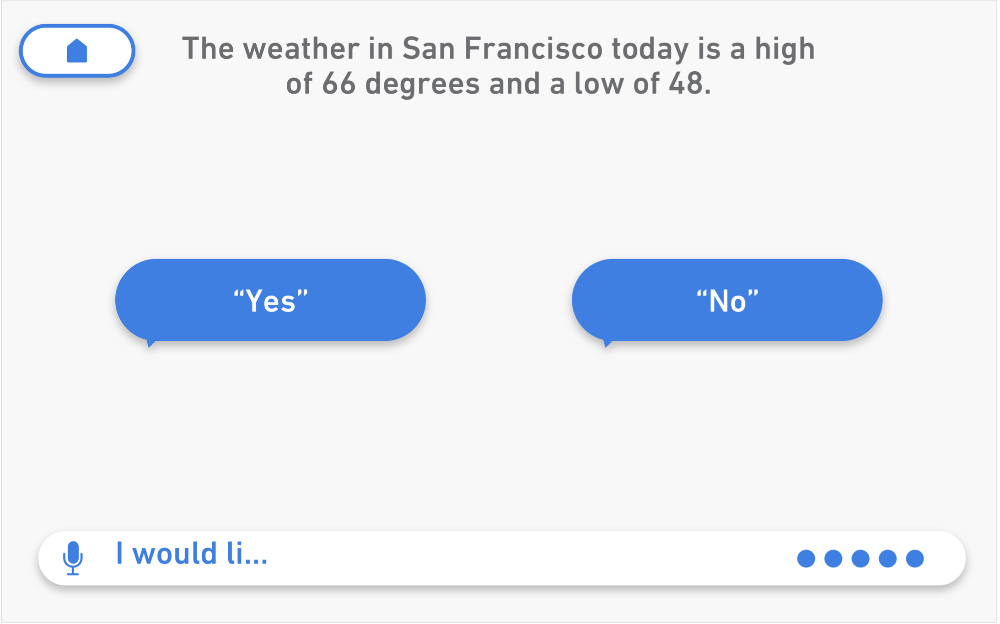


```ms_bot_framework
"""""""""""""""""""""""""""""""""""""""""
MS-Bot: Hero Card with Choices
"""""""""""""""""""""""""""""""""""""""""
{
  "type": "message",
  "attachments": [{
    "contentType": "application/vnd.microsoft.card.hero",
    "content": {
      "title": "Do you want to know about Puppies?",
      "buttons": [{
          "type": "imBack",
          "value": "Yes please",
          "title": "Yes please"
        },
        {
          "type": "imBack",
          "value": "No thanks",
          "title": "No thanks"
        }
      ]
    }
  }],
  "locale": "en-US",
  "localTimestamp": "2017-10-02T10:45:19-07:00",
  "from": {
    "id": "n5dm5eb6ldekh6a3",
    "name": "Bot"
  },
  "recipient": {
    "id": "default-user"
  },
  "inputHint": "acceptingInput",
  "replyToId": "i0gn412d30ag423i",
  "id": "j2j8245c6b9m12n3i",
  "channelId": "emulator",
  "timestamp": "2017-10-02T17:45:19.923Z",
  "conversation": {
    "id": "6ja3le587mmjbc4c"
  }
}

"""""""""""""MAPPING""""""""""""""""""""
Mapping (MS-Bot Hero Card w/ Choices -> Pepper Data Model):
attachments.content.buttons ~> show.content
attachments.content.buttons.title -> show.content.text
attachments.content.buttons.value -> show.content.value
attachments.content.title -> show.text
attachments.content.title -> speak

WHERE
~> = loosely mapped
-> = strictly mapped
""""""""""""""""""""""""""""""""""""""""
```

## IMAGE - Carousel, Captioned

> ACTIONABLE IMAGES & TEXT RESPONSE:

Selectable, Scrollable (3 max on tablet at a time)

Dimensions: 360w x 341t ea.

```dialogflow
"""""""""""""""""""""""""""""""""""""""""
Dialogflow:
""""""""""""""""""""""""""""""""""""""""
I.) UI:
For a given intent within your agent, under the 'Response'
section:
1) Click the + icon next to 'Default'
2) Select 'Google Assistant'
3) Under the 'Google Assistant' tab, select 'Add Message Content'
4) Select 'List'
5) Enter the URL of the picture
6) In the Title field, enter what you want Pepper to say and display
on its tablet according to the syntax described above ^^ in the 
'General Information' ({What Pepper Says} || {What Pepper displays})
7) In the field that says 'Enter option key...', enter a specific 
line of text that will trigger another custom intent that you will 
need to create to receive the action
8) Add as many list items as you want displayed


```


```ms_bot_framework
"""""""""""""""""""""""""""""""""""""""""
MS-Bot: Hero Card with Images and Choices
"""""""""""""""""""""""""""""""""""""""""
{
  "type": "message",
  "attachmentLayout": "carousel",
  "attachments": [{
      "contentType": "application/vnd.microsoft.card.thumbnail",
      "content": {
        "title": "Boxer",
        "subtitle": "A breed of utility dog.",
        "text": "The American boxer is a stocky, well built, strong-looking dog, with a large head and a muscular build. Its coat is short and generally smooth. The breed is a light to moderate shedder.",
        "images": [{
          "url": "https://static.pexels.com/photos/158682/snow-dog-de-bordeaux-158682.jpeg"
        }],
        "buttons": [{
          "type": "imBack",
          "value": "boxer",
          "title": "Boxer"
        }]
      }
    },
    {
      "contentType": "application/vnd.microsoft.card.thumbnail",
      "content": {
        "title": "Akita",
        "subtitle": "Continental Toy Spaniel",
        "text": "The Akita is a very intelligent and self-assured dog that has a very easy time learning new tricks. This dog can be sociable with children and strangers but is generally reserved around new people. ",
        "images": [{
          "url": "https://upload.wikimedia.org/wikipedia/commons/5/56/Papillon_Ears.jpg"
        }],
        "buttons": [{
          "type": "imBack",
          "value": "akita",
          "title": "Akita"
        }]
      }
    }
  ],
  "locale": "en-US",
  "localTimestamp": "2017-10-02T10:45:24-07:00",
  "from": {
    "id": "n5dm5eb6ldekh6a3",
    "name": "Bot"
  },
  "recipient": {
    "id": "default-user"
  },
  "inputHint": "acceptingInput",
  "replyToId": "dn58c2bfjd1089dkac",
  "id": "nbdk7b69eb0j9j69",
  "channelId": "emulator",
  "timestamp": "2017-10-02T17:45:24.902Z",
  "conversation": {
    "id": "6ja3le587mmjbc4c"
  }
}

"""""""""""""MAPPING""""""""""""""""""""
Mapping (MS-Bot -> Pepper Data Model):
attachments ~> show.content
attachments.title -> show.content.text
attachments.subtitle -> **ABANDONED**
attachments.text -> show.content.speak
attachments.images.url -> show.content.contentURL
attachments.buttons.value -> show.content.value

ADDED
speak: 'Tap or Say one of the following'
show.content.text: 'Tap or Say one of the following'

WHERE
~> = loosely mapped
-> = strictly mapped
""""""""""""""""""""""""""""""""""""""""
```


## IMAGE - Carousel, Uncaptioned

> ACTIONABLE IMAGES & TEXT RESPONSE:

Selectable, Scrollable (3 max on tablet at a time)

Dimensions: 360w x 361t ea.

```dialogflow
"""""""""""""""""""""""""""""""""""""""""
Dialogflow: 
""""""""""""""""""""""""""""""""""""""""
For a given intent within your agent, under the 'Response'
section, select 'Custom Payload' and enter the following:
{
  "title": "Tap or Say one of the following",
  "imageCards": [
    {
      "speak": "The American boxer is a strong-looking dog.",
      "contentURL": "https://static.pexels.com/photos/158682/snow-dog-de-bordeaux-158682.jpeg",
      "value": "boxer"
    },
    {
      "speak": "Its coat is short and generally smooth.",
      "contentURL": "https://static.pexels.com/photos/158682/snow-dog-de-bordeaux-158682.jpeg",
      "value": "boxer"
    },
    {
      "speak": "The Akita is a very intelligent dog.",
      "contentURL": "https://upload.wikimedia.org/wikipedia/commons/5/56/Papillon_Ears.jpg",
      "value": "akita"
    },
    {
      "speak": "This dog can be sociable with children.",
      "contentURL": "https://upload.wikimedia.org/wikipedia/commons/5/56/Papillon_Ears.jpg",
      "value": "akita"
    }
  ]
}
```

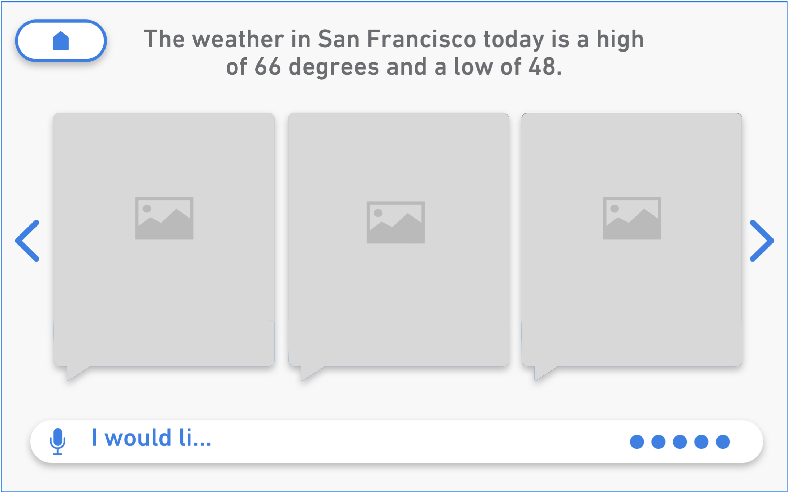

```ms_bot_framework
"""""""""""""""""""""""""""""""""""""""""
MS-Bot: N/A
"""""""""""""""""""""""""""""""""""""""""
Not available in MS-Bot
```

## IMAGE - 1-6-Icon Layouts

> ACTIONABLE IMAGES & TEXT RESPONSE:

Selectable, Non-Scrollable, Multiple-Icon Layouts (6 max total)
Background image configurable

Dimensions: 280w x 225t ea.

```dialogflow
"""""""""""""""""""""""""""""""""""""""""
Dialogflow: 
""""""""""""""""""""""""""""""""""""""""
For a given intent within your agent, under the 'Response'
section, select 'Custom Payload' and enter the following:
{
  "backgroundColor": "#d7d7d7",
  "backgroundImage": "https://pepperstoragedev.blob.core.windows.net/pepperdrive/41092db5-ee34-424a-bdf3-6bca579180af60cd05b2-4caf-47e3-b654-e69da3b6f81a.jpg",
  "text": "Background color code and image together",
  "speak": "Color code and image test",
  "customIcons": [
    {
      "iconUrl": "https://pepperstoragedev.blob.core.windows.net/pepperdrive/41092db5-ee34-424a-bdf3-6bca579180af6c4dfe53-5fa2-45a2-a431-4cf014fc750e.png",
      "value": "One icon",
      "text": "Icon 1",
      "speak": "Good choice"
    },
    {
      "iconUrl": "https://pepperstoragedev.blob.core.windows.net/pepperdrive/41092db5-ee34-424a-bdf3-6bca579180afa013ade8-f8b1-4c69-914e-4c255274c84c.png",
      "value": "Two icons",
      "text": "Icon 2",
      "speak": "OK"
    },
    {
      "iconUrl": "https://pepperstoragedev.blob.core.windows.net/pepperdrive/41092db5-ee34-424a-bdf3-6bca579180afde0a0ee6-947d-4ca7-918c-a034e6e65350.png",
      "value": "Three icons",
      "text": "Icon 3",
      "speak": "You got it"
    },
    {
      "iconUrl": "https://pepperstoragedev.blob.core.windows.net/pepperdrive/41092db5-ee34-424a-bdf3-6bca579180af6e65cd8c-9e2a-4db4-b65c-107b4629c1a8.png",
      "value": "Four icons",
      "text": "Icon 4",
      "speak": "Alright"
    },
    {
      "iconUrl": "https://pepperstoragedev.blob.core.windows.net/pepperdrive/41092db5-ee34-424a-bdf3-6bca579180af969a089b-884b-47e2-b896-b2b9f07eea31.png",
      "value": "Five icons",
      "text": "Icon 5",
      "speak": "Great"
    },
    {
      "iconUrl": "https://pepperstoragedev.blob.core.windows.net/pepperdrive/41092db5-ee34-424a-bdf3-6bca579180afc611cb65-0926-4ccb-b308-4f879f131ec8.png",
      "value": "Six icons",
      "text": "Icon 6",
      "speak": "Wonderful"
    }
  ]
}
```

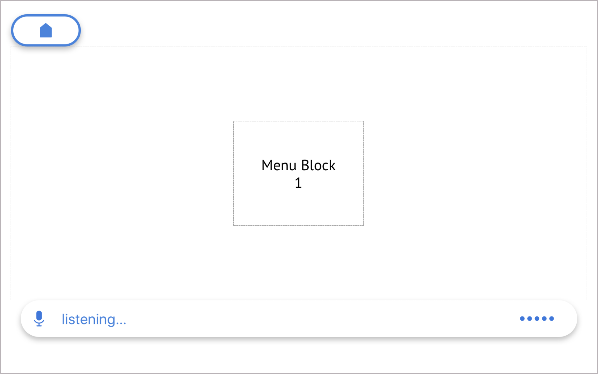
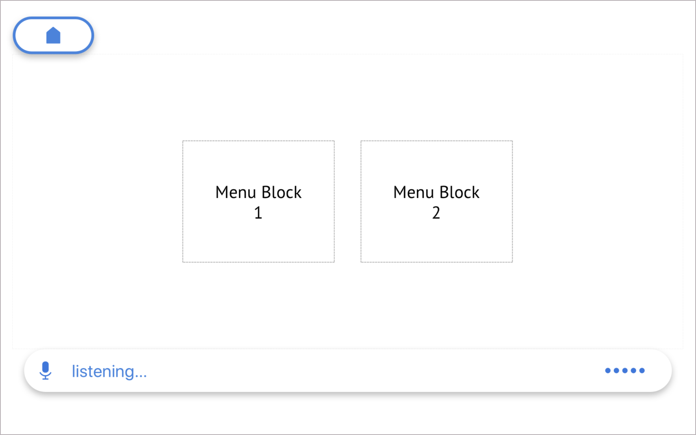
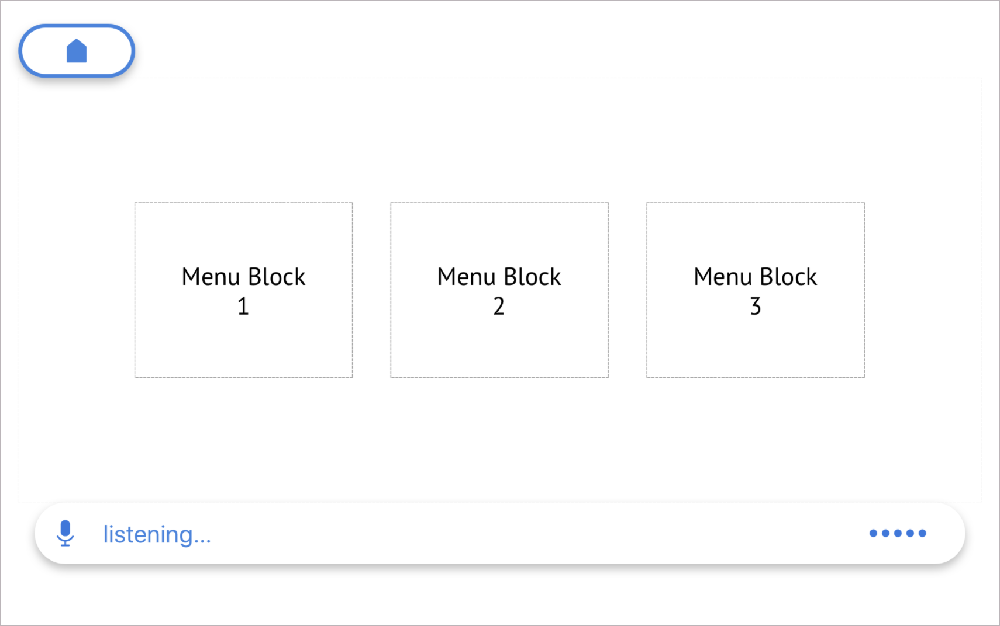
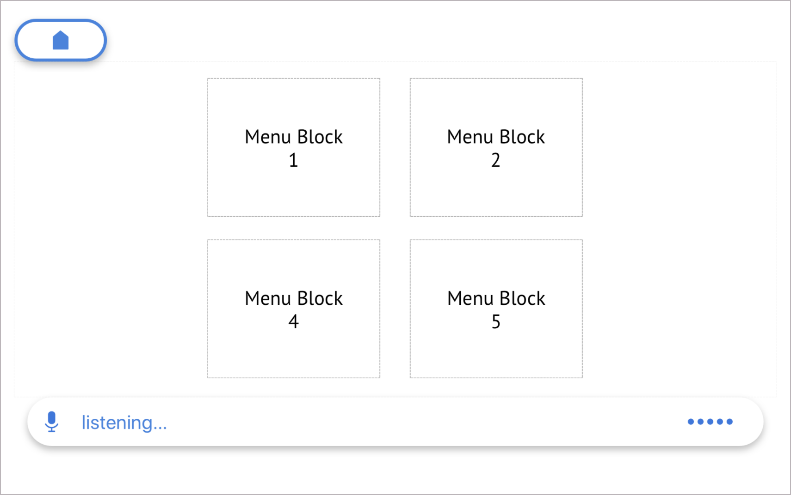
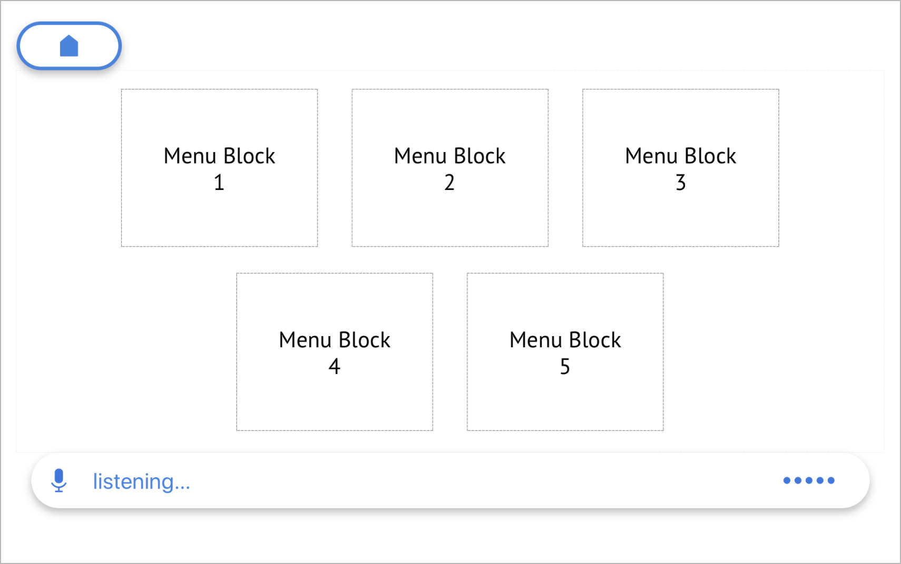
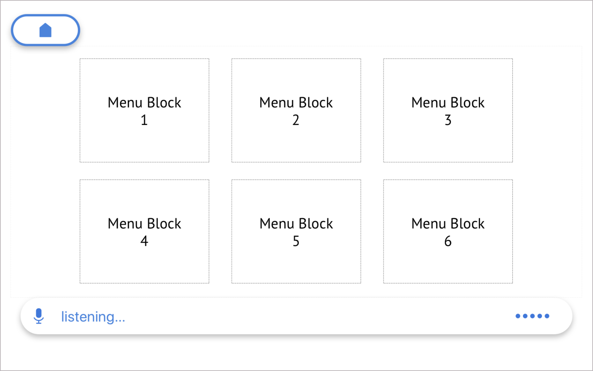
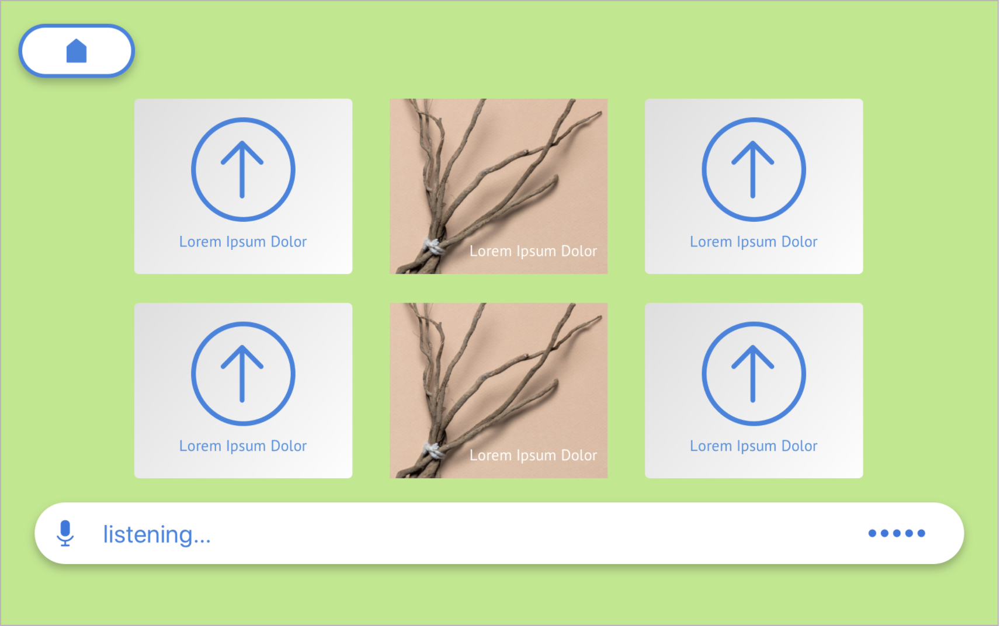

```ms_bot_framework
"""""""""""""""""""""""""""""""""""""""""
MS-Bot: N/A
"""""""""""""""""""""""""""""""""""""""""
Not available in MS-Bot
```


## IMAGE - Basic Card

> IMAGE RESPONSE - Basic Card

Non-selectable, must be followed by text bubbles to be selectable<br>

Dimensions: <br>
&#160;&#160;&#160;&#160;&#160;&#160;&#160;&#160;- approx. 975w x 585t for landscape Basic Cards<br>
&#160;&#160;&#160;&#160;&#160;&#160;&#160;&#160;- approx. 415w x 585t for portrait Basic Cards

```dialogflow
"""""""""""""""""""""""""""""""""""""""""""""""""""""""""""
Dialogflow: Non-actionable Images (with follow-up buttons)
""""""""""""""""""""""""""""""""""""""""""""""""""""""""""
I.) UI:
For a given intent within your agent, under the 'Response'
section:
1) Click the + icon next to 'Default'
2) Select 'Google Assistant'
3) Under the 'Google Assistant' tab, select 'Add Message Content'
4) Select 'Basic Card'
5) Enter the URL of the picture
6) In the 'Title' field, enter what you want Pepper to say and display
on its tablet according to the syntax described above ^^ in the 
'General Information' section: ({What Pepper Says} || {What Pepper displays})

Note: with non-actionable images, it is recommended to keep the conversation
alive with a follow-up message. To prompt the user for another action, 
simply combine the Basic Card with the Google Assistant Suggestion Chips.


```


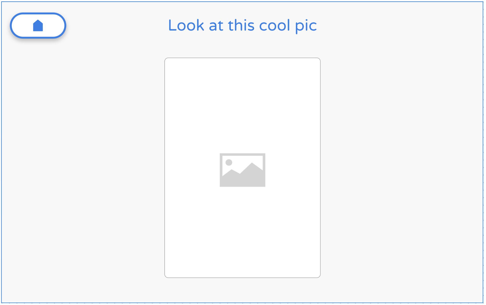

```ms_bot_framework
"""""""""""""""""""""""""""""""""""""""""
MS-Bot: Image Attachments response:
"""""""""""""""""""""""""""""""""""""""""
{
  "type": "message",
  "attachments": [{
      "contentUrl": "http://www.greathillpartners.com/wp-content/uploads/Golden-Puppy.jpg",
      "contentType": "image/jpg",
      "name": "Puppy pic 1"
    },
    {
      "contentUrl": "https://i.ytimg.com/vi/VRiWE1l8KqI/maxresdefault.jpg",
      "contentType": "image/jpg",
      "name": "Puppy pic 2"
    },
    {
      "contentUrl": "http://24.media.tumblr.com/53e3171e750c6c1028f8200ad73c8a53/tumblr_mkozt0qp3B1qiwf8po1_500.jpg",
      "contentType": "image/jpg",
      "name": "Puppy pic 1"
    }
  ],
  "text": "Here are some puppies",
  "locale": "en-US",
  "localTimestamp": "2017-10-02T11:01:51-07:00",
  "from": {
    "id": "default-bot",
    "name": "Bot"
  },
  "recipient": {
    "id": "default-user"
  },
  "inputHint": "ignoringInput",
  "replyToId": "3j6714mfbl49hf1bac",
  "id": "688k3bd50e8ifk364c",
  "channelId": "emulator",
  "timestamp": "2017-10-02T18:01:51.235Z",
  "conversation": {
    "id": "efj6c25bj3e43b0c9"
  }
}

"""""""""""""MAPPING""""""""""""""""""""
Mapping (MS-Bot -> Pepper Data Model):
attachments ~> show.content
attachments.contentUrl-> show.content.contentURL
attachments.contentType-> show.content.contentType
text -> speak
text -> show.text

WHERE
~> = loosely mapped
-> = strictly mapped
""""""""""""""""""""""""""""""""""""""""
```


##  IMAGE - Fullscreen Image

> IMAGE RESPONSE - Fullscreen Image:

Selectable, Non-Scrollable - 1280w x 800t

```dialogflow
"""""""""""""""""""""""""""""""""""""""""
Dialogflow: 
""""""""""""""""""""""""""""""""""""""""
I.) UI:
A.) Selectable:
For a given intent within your agent, under the 'Response'
section, click 'Add Message Content', select 'Custom Payload' 
and copy and paste the following:
{
  "backgroundColor": "#d7d7d7",
  "backgroundImage": "https://pepperstoragedev.blob.core.windows.net/pepperdrive/c8f7061d-cd26-4807-8113-209cf7f574738baae0ca-27e1-4998-8732-7042c66e12ad.jpg",
  "speak": "Here is an actionable background image ||"
}
B.) Non-selectable:
{
  "imageURL": "https://pepperstoragedev.blob.core.windows.net/files/Default_Story_1.jpg",
  "speak": "Hi, I dont know how much you know about me, but I am here to be your host.",
  "delay": 2
}

Notes: 

A) With non-actionable images, it is recommended to keep the conversation
alive with a follow-up message. To prompt the user for another action, 
simply combine the Basic Card with the Google Assistant Suggestion Chips.

B) When using JSON (^^), any QiChat commands must be double-escaped (\\).


```


```ms_bot_framework
"""""""""""""""""""""""""""""""""""""""""
MS-Bot: Full Screen Image response:
""""""""""""""""""""""""""""""""""""""""

Not yet available in MS-Bot
```


## IMAGE - Sequence of Images

> IMAGE RESPONSE - Sequence of Images

```dialogflow
"""""""""""""""""""""""""""""""""""""""""
Dialogflow: IMAGE RESPONSE
""""""""""""""""""""""""""""""""""""""""
To create a non-actionable sequence of (full screen) images, use the
'Full Screen Image Response' described above. Chain the Custom
Payloads together, one after another, to create a story.
```


```ms_bot_framework
"""""""""""""""""""""""""""""""""""""""""
MS-Bot: Image Attachments response:
"""""""""""""""""""""""""""""""""""""""""
{
  "type": "message",
  "attachments": [{
      "contentUrl": "http://www.greathillpartners.com/wp-content/uploads/Golden-Puppy.jpg",
      "contentType": "image/jpg",
      "name": "Puppy pic 1"
    },
    {
      "contentUrl": "https://i.ytimg.com/vi/VRiWE1l8KqI/maxresdefault.jpg",
      "contentType": "image/jpg",
      "name": "Puppy pic 2"
    },
    {
      "contentUrl": "http://24.media.tumblr.com/53e3171e750c6c1028f8200ad73c8a53/tumblr_mkozt0qp3B1qiwf8po1_500.jpg",
      "contentType": "image/jpg",
      "name": "Puppy pic 1"
    }
  ],
  "text": "Here are some puppies",
  "locale": "en-US",
  "localTimestamp": "2017-10-02T11:01:51-07:00",
  "from": {
    "id": "default-bot",
    "name": "Bot"
  },
  "recipient": {
    "id": "default-user"
  },
  "inputHint": "ignoringInput",
  "replyToId": "3j6714mfbl49hf1bac",
  "id": "688k3bd50e8ifk364c",
  "channelId": "emulator",
  "timestamp": "2017-10-02T18:01:51.235Z",
  "conversation": {
    "id": "efj6c25bj3e43b0c9"
  }
}

"""""""""""""MAPPING""""""""""""""""""""
Mapping (MS-Bot -> Pepper Data Model):
attachments ~> show.content
attachments.contentUrl-> show.content.contentURL
attachments.contentType-> show.content.contentType
text -> speak
text -> show.text

WHERE
~> = loosely mapped
-> = strictly mapped
""""""""""""""""""""""""""""""""""""""""
```


##  VIDEO - Fullscreen Video

> VIDEO RESPONSE:

Skippable - 1280w x 800t - .mp4 format required
YouTube / Vimeo / etc. video links do not work

```dialogflow
"""""""""""""""""""""""""""""""""""""""""
Dialogflow: VIDEO RESPONSE
""""""""""""""""""""""""""""""""""""""""
I.) UI:
For a given intent within your agent, under the 'Response'
section, click 'Add Message Content', select 'Custom Payload'
and copy and paste the following:
{
  "videoURL": "https://url-of-your-video-file.mp4",
  "contentType": "video/mp4",
  "speak": "Here is a short video that is relevant to your utterance..."
}

Note: When using JSON (^^), any QiChat commands must be double-escaped (\\).

```


```ms_bot_framework
"""""""""""""""""""""""""""""""""""""""""
MS-Bot: Video Only response:
"""""""""""""""""""""""""""""""""""""""""
{
  "type": "message",
  "attachments": [{
    "contentUrl": "https://pepperstoragedev.blob.core.windows.net/pepperstories/b68b2247-f74a-4f6b-b3ad-3e7e66c1e600.mp4?decache=QLT1MXCSF1A9",
    "contentType": "video/mp4",
    "name": "Puppy video"
  }],
  "text": "Here is a puppy video",
  "locale": "en-US",
  "localTimestamp": "2017-10-02T11:09:03-07:00",
  "from": {
    "id": "default-bot",
    "name": "Bot"
  },
  "recipient": {
    "id": "default-user"
  },
  "inputHint": "acceptingInput",
  "replyToId": "f0igi03ln2f4fem94c",
  "id": "ek9im8g5df0e305bf",
  "channelId": "emulator",
  "timestamp": "2017-10-02T18:09:03.318Z",
  "conversation": {
    "id": "mb6c0bcdl2eclij9i"
  }
}

"""""""""""""MAPPING""""""""""""""""""""
Mapping (MS-Bot -> Pepper Data Model):
attachments ~> show.content
attachments.contentUrl-> show.content. contentURL
attachments.contentType-> show.content.contentType
text -> speak
text -> show.text

WHERE
~> = loosely mapped
-> = strictly mapped
""""""""""""""""""""""""""""""""""""""""
```


## WEBPAGE - Show Webpage

> WEBPAGE - SHOW WEBPAGE:

You may now display webpages on Pepper through your chatbot! The webpage allows scrolling and a convenient exit icon in the upper righthand corner. It is recommended to build custom HTML pages specifically for Pepper and to host them via <a href="https://softbankroboticstraining.github.io/pepper-chatbot-api/#pepper-drive">Pepper Drive</a>.


<aside class="success">Feature Details: <br>• To prevent undesired end user navigation to other websites, no URL bar is displayed. <br>• Hyperlinks can be followed, so long as they do not create a new tab. The href target attribute "self" needs to be specified for the hyperlink; this opens the linked document in the same window as it was clicked (this is default). </aside> 

<aside class="notice">Limitations: <br>• One important limitation to this feature is that the website must allow embedding within an iFrame. If the website does not allow embedding, it will produce an "X-Frame Origin Error" and will display a blank screen on Pepper. <br> • Additionally, all pop-up windows, including modal windows, will be blocked from display. </aside>


```dialogflow
"""""""""""""""""""""""""""""""""""""""""
Dialogflow: 
""""""""""""""""""""""""""""""""""""""""
I.) UI:
For a given intent within your agent, under the 'Response'
section, click 'Add Message Content', select 'Custom Payload'
and copy and paste the following:
{
  "speak": "Here is a webpage ||",
  "action": "showWebpage",
  "action_parameters": {
    "url": "https://www.theorganproject.net/promote-registration-individuals/",
    "onClose": "Web page closed"
  }
}

```

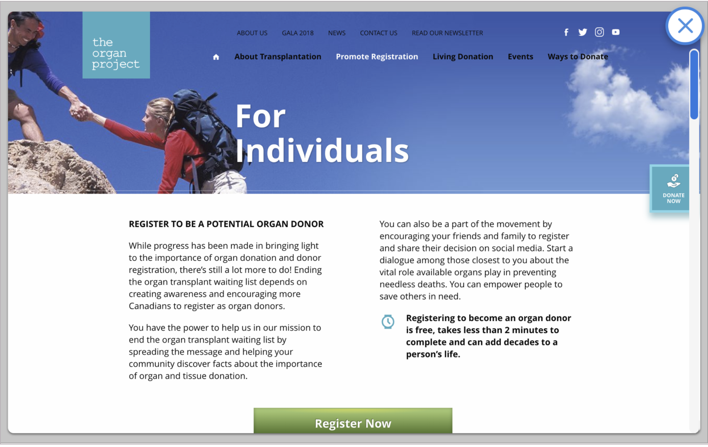
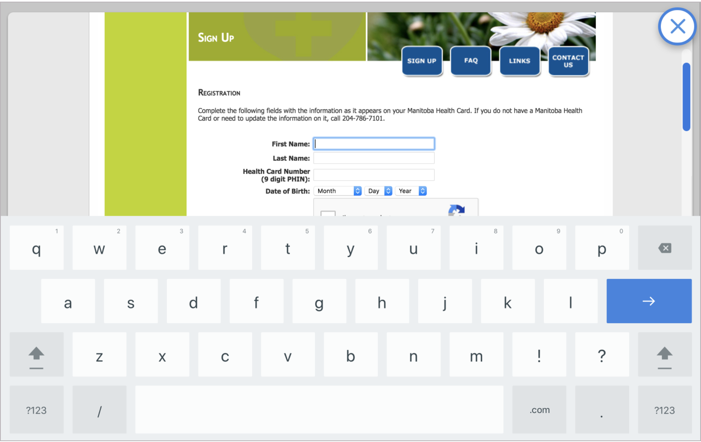

```ms_bot_framework
"""""""""""""""""""""""""""""""""""""""""
MS-Bot: Show a webpage
""""""""""""""""""""""""""""""""""""""""
Not yet available in MS-Bot
```


## USER INPUT - SHOW KEYBOARD

> USER INPUT - SHOW KEYBOARD:

```dialogflow
"""""""""""""""""""""""""""""""""""""""""
Dialogflow: 
""""""""""""""""""""""""""""""""""""""""
For a given intent within your agent, under the 'Response'
section, select 'Custom Payload' and enter the following:
{
  "speak": "Type your confirmation number using the keyboard."
  "action": "showKeyboard"
}
```


```ms_bot_framework
"""""""""""""""""""""""""""""""""""""""""
MS-Bot: Show Keyboard response:
""""""""""""""""""""""""""""""""""""""""

Not yet available in MS-Bot
```

##  USER INPUT - PRIVACY POLICY

> PRIVACY POLICY - Checkbox:

###CHECKBOX
Keyboard with checked box with Privacy Policy displayed (for CTA) - .PDF format only

```dialogflow
"""""""""""""""""""""""""""""""""""""""""
Dialogflow: PRIVACY POLICY - CHECKBOX
""""""""""""""""""""""""""""""""""""""""
I.) UI: 
For a given intent within your agent, under the 'Response'
section, click 'Add Message Content', select 'Custom Payload'
and copy and paste the following:
{
  "speak": "Please type in your email and agree to our privacy policy to continue",
  "privacyPolicy": {
    "url": "https://pepperstoragedev.blob.core.windows.net/pepperdrive/41092db5-ee34-424a-bdf3-6bca579180afprivacy-policy-template.pdf",
    "inputType": "email",
    "checkBoxChecked": true
  }
}

Note: With non-actionable images, it is recommended to keep the conversation
alive with a follow-up message. To prompt the user for another action, 
simply combine the Basic Card with the Google Assistant Suggestion Chips.

```

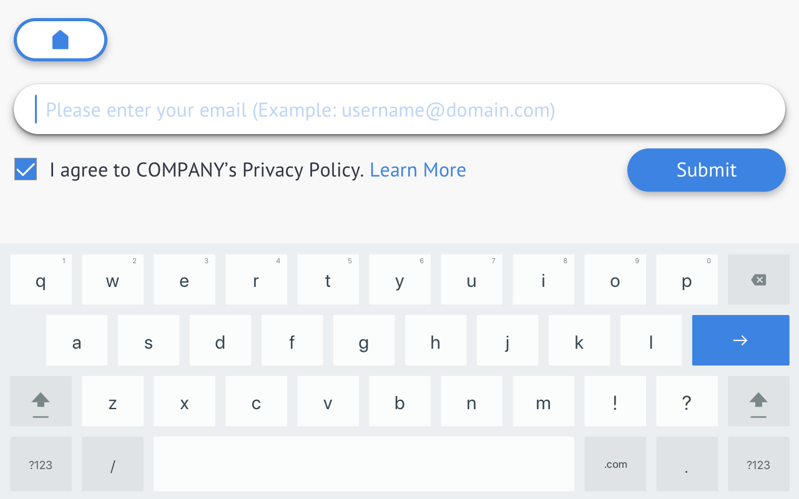
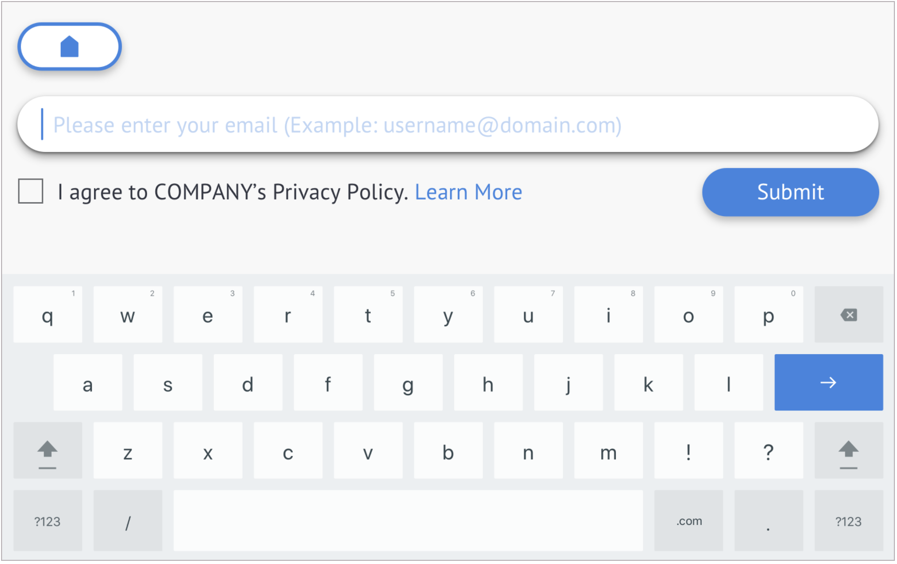

```ms_bot_framework
"""""""""""""""""""""""""""""""""""""""""
MS-Bot: PRIVACY POLICY
""""""""""""""""""""""""""""""""""""""""
Not yet available in MS-Bot
```

###MODAL DIALOG POP-UP

> PRIVACY POLICY - Modal Dialog Pop-Up:

Modal window pops up with Privacy Policy displayed (for CTA) - .PDF format only

```dialogflow
"""""""""""""""""""""""""""""""""""""""""
Dialogflow: PRIVACY POLICY - Modal Dialog Pop-up
""""""""""""""""""""""""""""""""""""""""
I.) UI:
For a given intent within your agent, under the 'Response'
section, click 'Add Message Content', select 'Custom Payload'
and copy and paste the following:
{
  "speak": "Please enter your email",
  "privacyPolicy": {
    "url": "https://pepperstoragedev.blob.core.windows.net/pepperdrive/41092db5-ee34-424a-bdf3-6bca579180afprivacy-policy-template.pdf",
    "inputType": "email",
    "forcedPopup": true
  }
}

Note: With non-actionable images, it is recommended to keep the conversation
alive with a follow-up message. To prompt the user for another action, 
simply combine the Basic Card with the Google Assistant Suggestion Chips.

```

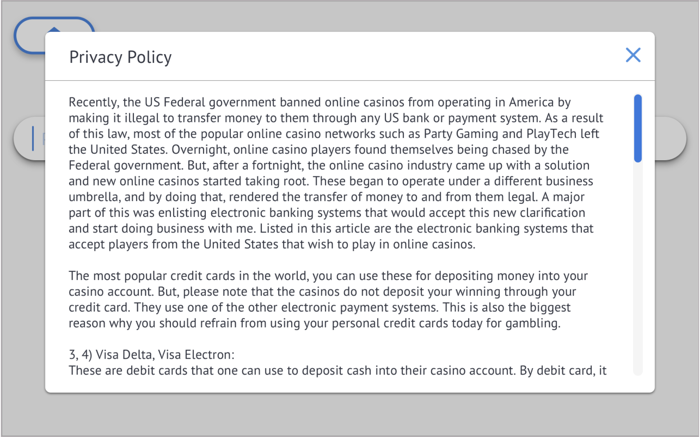
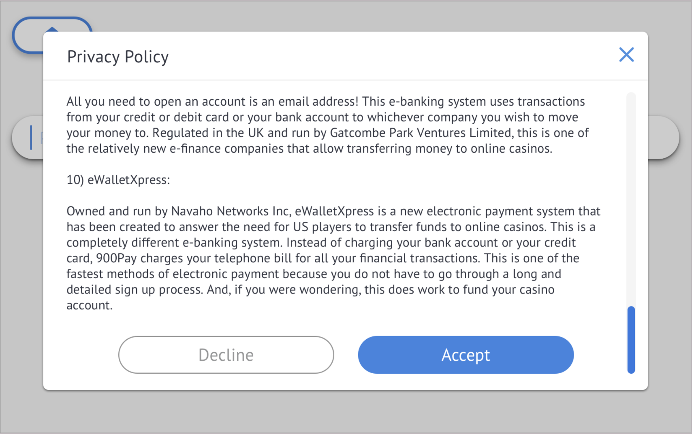

```ms_bot_framework
"""""""""""""""""""""""""""""""""""""""""
MS-Bot: PRIVACY POLICY
""""""""""""""""""""""""""""""""""""""""
Not yet available in MS-Bot
```

# → Styling

### TABLET UI SETTINGS

> TABLET UI SETTINGS - UPDATE CHATBOT STYLE

Configures style and settings for the chatbot's UI.

```dialogflow
"""""""""""""""""""""""""""""""""""""""""
Dialogflow:  UPDATE CHATBOT STYLE
""""""""""""""""""""""""""""""""""""""""
For a given intent within your agent, under the 'Response'
section, select 'Custom Payload' and enter the following:
{
  "speak": "Setting background image and color ||",
  "action": "setStyle",
  "action_parameters": {
    "backgroundColor": "#ebc6eb",
    "backgroundImage": "https://pepperstoragedev.blob.core.windows.net/pepperdrive/41092db5-ee34-424a-bdf3-6bca579180afbd2dcbc8-f435-4615-b63c-4274d66d7993.png",
    "restoreDefault": false,
    "nextUtterance": "Start"
  }
}

Notes:
- "speak" property is optional. 
- "action" property is required to set the style (value = "setStyle")
- Set "restoreDefault" to true to restore the original (default)
 chatbot screen style. "backgroundColor" and "backgroundImage" 
 properties can be omitted in this case (ignored if present).
- Use it if you want Pepper to say something when chatbot style 
is updated.
- "nextUtterance" property is also optional. You can trigger 
next chatbot intent automatically after changing the style by 
assigning one of intent phrases to this property.
- Use "default" as "backgroundColor" or "backgroundImage" value 
to restore the original state of corresponding property
- Use "none" as "backgroundImage" to remove the image
- Style changes persist until the end of chatbot session. Original 
chatbot style is restored every time chatbot session is restarted.

```

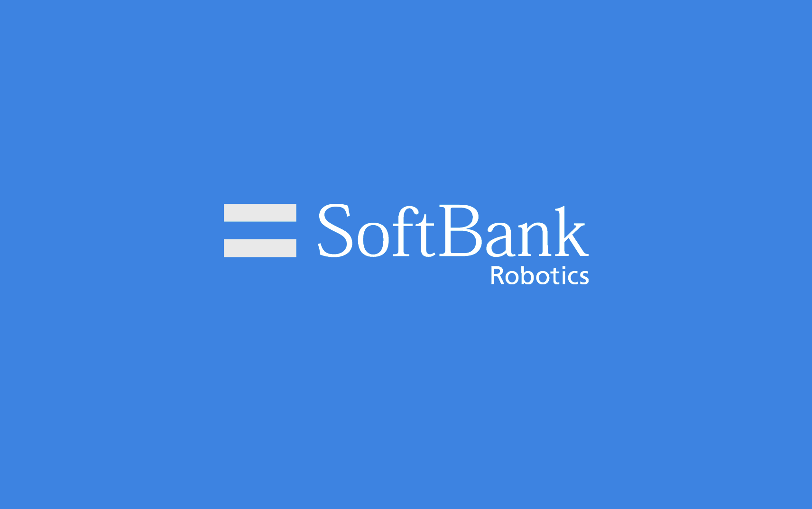


###BACKGROUND - SET COLOR

```dialogflow
"""""""""""""""""""""""""""""""""""""""""
Dialogflow:  SET BACKGROUND COLOR
""""""""""""""""""""""""""""""""""""""""
I.) UI: 
For a given intent within your agent, under the 'Response'
section, select 'Custom Payload' and enter the following:
{
  "backgroundColor": "#d7d7d7",
  "speak": "Here is a background color ||"
}

```


```ms_bot_framework
"""""""""""""""""""""""""""""""""""""""""
MS-Bot: SET BACKGROUND COLOR
""""""""""""""""""""""""""""""""""""""""

Not yet available in MS-Bot
```

### BACKGROUND - SET IMAGE

```dialogflow
"""""""""""""""""""""""""""""""""""""""""
Dialogflow:  SET BACKGROUND IMAGE
""""""""""""""""""""""""""""""""""""""""
I.) UI: 
For a given intent within your agent, under the 'Response'
section, select 'Custom Payload' and enter the following:
{
  "backgroundColor": "#d7d7d7",
  "backgroundImage": "https://pepperstoragedev.blob.core.windows.net/pepperdrive/c8f7061d-cd26-4807-8113-209cf7f574738baae0ca-27e1-4998-8732-7042c66e12ad.jpg",
  "speak": "Here is an actionable background image ||"
}

```


```ms_bot_framework
"""""""""""""""""""""""""""""""""""""""""
MS-Bot: SET BACKGROUND IMAGE
""""""""""""""""""""""""""""""""""""""""

Not yet available in MS-Bot
```

### OTHER UI SETTINGS
> CUSTOM PAYLOADS:
You can generally insert any of the following properties (here listed with sample values) into any response that takes a custom payload (although some may not render successfully with some custom payloads): <br>
  "backgroundColor": "#ccccff",<br>
  "backgroundImage": "https://pepperstoragedev.blob.core.windows.net/pepperdrive/41092db5-ee34-424a-bdf3-6bca579180af57646fd2-3e12-48db-bc23-36e597b697ef.png",<br>
  "textColor": "red",<br>
  "font": "Courier New",<br>
  "bubbleColor": "green",<br>
  "bubbleTextColor": "yellow",<br>
  "bubbleFont": "Fantasy"<br>

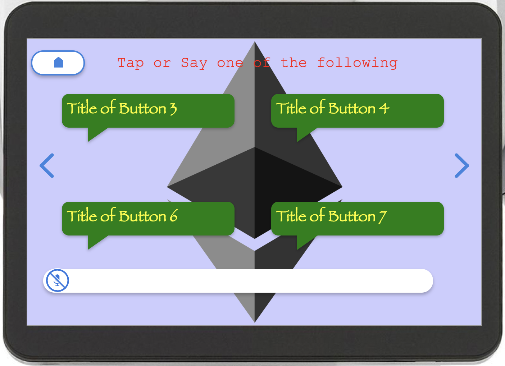


```ms_bot_framework
"""""""""""""""""""""""""""""""""""""""""
MS-Bot: UPDATE CHATBOT STYLE
""""""""""""""""""""""""""""""""""""""""

Not yet available in MS-Bot
```


# →  Pepper Drive

### Pepper Drive

The Pepper Chat CMS comes equipped with its own file webserver for all your chatbot's assets, including its image, video, PDF (privacy policies, etc.) and HTML (basic websites) files.

> LEVERAGE PEPPER DRIVE <br>
> Level up your Pepper experience by including multimedia and interactive HTML pages in Pepper's responses!

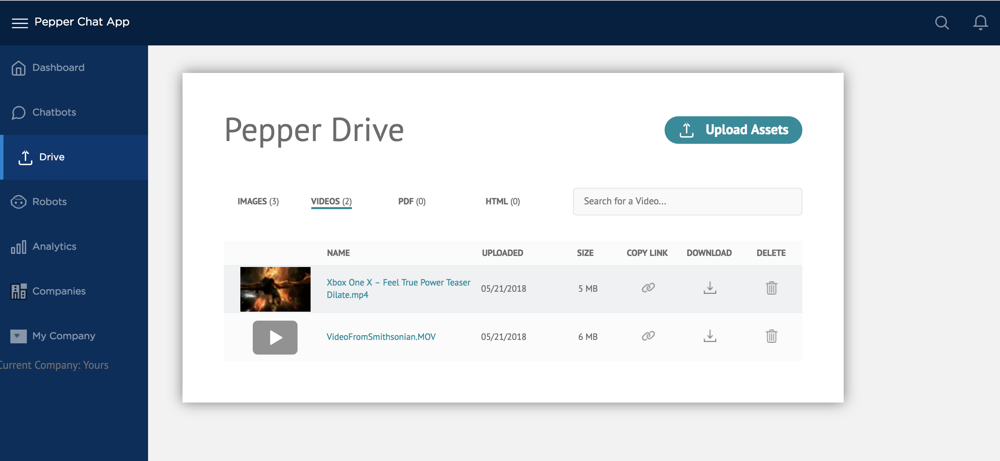


# →  Spoken vs Displayed Text

### WHAT PEPPER SPEAKS vs. WHAT PEPPER DISPLAYS ON TABLET:

By default, Pepper both speaks and displays on his tablet the text 
written in the response field. That is oftentimes not desirable 
behavior. For instance, you may want Pepper to display the opposite
of what he is saying as part of a game or survey. By using the 
following convention in your chatbot responses, you can make Pepper 
say one thing and display another. Simply use double pipes (||), 
according to the following syntax:
### Pepper: {What Pepper Says} || {What Pepper displays on the tablet}

> Ex: Hello, human! || 😃 <br>
In this example, Pepper will say 'Hello, human!' while displaying
an emoji smiley face: 😃.

> Ex: ig pay atin lay ample xay || Pig Latin example <br>
I think you see what I did there  ^^ ;) 

<br>
Examples:
<br>
User: Hello, robot! <br>
Pepper: {What Pepper Says} || {What Pepper displays on the tablet} <br>
→ View how to do it → <br>
<br>
User: Can you speak Pig Latin, Pepper? <br>
Pepper: {What Pepper Says} || {What Pepper displays on the tablet} <br>
→ View how to do it → <br>


# →  Voice Shaping Commands

> Pepper Voice Shaping Commands - <br><br>"Did you know? <br>💡💡💡💡💡💡💡💡💡💡💡💡💡<br> QiChat is Pepper's native language.

Below are some useful voice commands a chatbot creator can use to control Pepper's delivery of certain lines or words. These commands are used as a markup language throughout a chatbot to wrap a word (or a series of words) in order to change the intonation and speed of Pepper's voice as he speaks the word(s)! In order to use these commands, you must end the sentence with the double pipes (||) and provide a clean, non QiChat version of the text.

<br><br>
##QiChat voice commands * | * * :
<code>\pau=1000\ </code> = Inserts a pause (in milliseconds)<br>
<code>\rspd=100\ </code> = Speed of voice (in percentage, 50-400)<br>
<code>\vct=100\ </code> = Pitch of voice (in percentage, 50=200)<br>
<code>\vol=100\ </code> = Volume of voice (in percentage, 0-100)<br>
<code>\style=joyful\ </code> = Joyful intonation<br>
<code>\style=neutral\ </code> = Normal intonation<br>
<code>\style=didactic\ </code> = Didactic intonation<br>
<code>\rst\ </code> = Resets control sequences<br>

> 
Ex. Usage: To imitate an emotional response <br>
User: Pepper you're fired! <br>
Pepper: \style=joyful\ No! \pau=100\ Please! \pau=500\ I need this job. \style=neutral\ ||  No!  Please! I need this job. ... 

>
Ex. Usages: (1) To pause for dramatic effect; (2) to emphasize a word or syllable (puns)<br>
Pepper: Want to hear a joke about a piece of paper? \pau=800\ Never <br>
mind \pau=400\ it's \pau=300\ \rspd=50\ tearable. \rspd=100\ || Want to hear a joke about a piece of paper? Nevermind. It's terrible.

<aside class='info'> * When using JSON syntax (Custom Payloads, etc.), QiChat commands must be double-escaped (\\).</aside>

<aside class='warning'> * * WARNING: The Pepper Chat Simulator (available in web-based <a href="https://pepper-chat.azurewebsites.net">Pepper Chat CMS</a>) does not support QiChat codes at this point!</aside>
<br>


# →  Pepper Animations
You have access to Pepper's full library of animations! Take advantage of them by first becoming familiar with the various animations in the library by playing them live on your Pepper from within Choregraphe (see instructions to the right → )
<br>
> 1) Install Choregraphe (free) from our website: https://developer.softbankrobotics.com/us-en/downloads/pepper
<br>
2) Connect to your robot from within Choregraphe using its IP address
<br>
3) Find (and activate if not activated) the Robot Applications panel
<br>
4) Find application called "Animation Library" and uncollapse it
<br>
5) Demo and animation by pressing its play icon in the Robot Applications panel

##Animation Playback Modes

When playing an animation, you have to choose one of two options for how the animation should be played:<br><br>
> Ex.) Dialogflow - Pepper's response: <br> Hi! ^run(animations/Stand/Emotions/Positive/Happy_4) It's great to see you!

<br>

>Ex.) Dialogflow - Pepper's response: <br> Hi! ^start(animations/Stand/Emotions/Positive/Excited_1) I'm so excited to see you! ^wait(animations/Stand/Emotions/Positive/Excited_1) It's nice to see you in our store again!

###RUN mode:
<ul>
  <li> Stops the speech until the animation has finished </li>
  <li>^run(...robot-animation-1)</li>
</ul>

###START mode:
<ul>
   <li>Start the animation and allow it to play, but allow the speech to continue while the animation is playing</li>
   <li>^start(...robot-animation-2)</li>
</ul>

<br>


# → Actions

The section below shows all the various actions that can be performed within a Chatbot context:


###ACTIONS - PRIMARY:
<ul>
  <li><a href="https://softbankroboticstraining.github.io/pepper-chatbot-api/#actions-run-application">RUN APPLICATION</a> - Launches external application - maintains chatbot session persistence</li>
  <li><a href="https://softbankroboticstraining.github.io/pepper-chatbot-api/#actions-play-a-game">PLAY A GAME</a> - Play a pre-installed game.</li>
  <li><a href="https://softbankroboticstraining.github.io/pepper-chatbot-api/#actions-trigger-an-intent">TRIGGER AN INTENT</a> - Provide an utterance to an intent you want to trigger </li>
</ul>

###ACTIONS - MISCELLANEOUS
<ul>
  <li><a href="https://softbankroboticstraining.github.io/pepper-chatbot-api/#actions-switch-language">SET LANGUAGE</a>
  Change the language Pepper is using</li>
  <li><a href="https://softbankroboticstraining.github.io/pepper-chatbot-api/#actions-get-robot-location">GET LOCATION</a>
  Returns geo-location of robot</li>
  
</ul>

## ACTIONS - RUN APPLICATION

> ACTIONS - RUN APPLICATION

Launches external application - maintains chatbot session persistence


```dialogflow
"""""""""""""""""""""""""""""""""""""""""
Dialogflow: RUN AN APPLICATION
""""""""""""""""""""""""""""""""""""""""
For a given intent within your agent, under the 'Response'
section, select 'Custom Payload' and enter the following:
{
  "speak": "Launching Survey application",
  "action": "startApp",
  "action_parameters": {
    "appId": "pepper-survey/."
  }
}

```


```ms_bot_framework
"""""""""""""""""""""""""""""""""""""""""
MS-Bot: RUN APPLICATION
""""""""""""""""""""""""""""""""""""""""
Not yet available in MS-Bot
```


## ACTIONS - PLAY A GAME

> ACTIONS - PLAY A GAME:

```dialogflow
"""""""""""""""""""""""""""""""""""""""""
Dialogflow: PLAY A GAME
""""""""""""""""""""""""""""""""""""""""
I.) UI:
  A.) To initiate a specific game, under the 'Response' section, 
  select 'Custom Payload' and enter the following:
  {
    "speak": "Initiating selfie mode."
    "action": "playGame",
    "action_parameters": {
      "gameName": "Take a Selfie"
    }
  }

    Current Game Options:
    - 'Mindfulness Minute'
    - 'Freestyle dance'
    - 'Take a Selfie'
    - 'Music Boxes'
    - 'Arcadia dance' - CURRENTLY UNAVAILABLE

  B.) To initiate a random game, under the 'Response' section, 
  select 'Custom Payload' and enter the following:
  { 
    "payloadType": "action",
    "action": "playRandomGame"
  }

```


```ms_bot_framework
"""""""""""""""""""""""""""""""""""""""""
MS-Bot: Play a Game response:
""""""""""""""""""""""""""""""""""""""""

Not yet available in MS-Bot
```


## ACTIONS - TRIGGER AN INTENT

> ACTIONS - TRIGGER AN INTENT

HACK: Using the 'Update Chatbot Style' action payload, you can actually trigger another intent. 
Provide an utterance to an intent you want to trigger

```dialogflow
"""""""""""""""""""""""""""""""""""""""""
Dialogflow:  TRIGGER AN INTENT
""""""""""""""""""""""""""""""""""""""""
I.) UI: 
For a given intent within your agent, under the 'Response'
section, select 'Custom Payload' and enter the following:
{
  "action": "setStyle",
  "action_parameters": {
    "nextUtterance": "Start"
  }
}

```

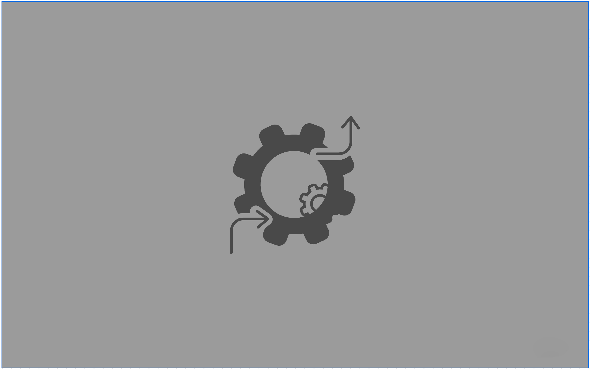

```ms_bot_framework
"""""""""""""""""""""""""""""""""""""""""
MS-Bot: TRIGGER AN INTENT
""""""""""""""""""""""""""""""""""""""""

Not yet available in MS-Bot
```

## ACTIONS - SWITCH LANGUAGE

> ACTIONS - SWITCH LANGUAGE

Changes the language Pepper is using. 

supportedLanguages: [
            'English',
            'Spanish',
            'French',
            'Japanese',
            'Chinese'
        ],
        dialogFlow: {
            English: 'en',
            Spanish: 'es',
            French: 'fr',
            Japanese: 'ja',
            Chinese: 'zh-CN'
        }

<aside type='info'>NOTE: Requires that you have a multilingual agent. Also note that this will change the language for the entire communication system involving Pepper.  This includes Pepper's language, the transcription service language, and the agent's language.  </aside>

```dialogflow
"""""""""""""""""""""""""""""""""""""""""
Dialogflow:  SWITCH THE LANGUAGE
""""""""""""""""""""""""""""""""""""""""
I.) UI: 
Setting the language requires your Dialogflow agent be multilingual. For a given intent within your agent, under the 'Response' section, select 'Custom Payload' and enter the following:
{
  "action": "setLanguage",
  "action_parameters": {
    "language": "Spanish"
  }
}

```


```ms_bot_framework
"""""""""""""""""""""""""""""""""""""""""
MS-Bot: SWITCH THE LANGUAGE
""""""""""""""""""""""""""""""""""""""""

Not yet available in MS-Bot
```


## ACTIONS - GET ROBOT LOCATION

> ACTIONS - GET ROBOT LOCATION

{COMING SOON - AVAILABLE TODAY ONLY IN DOGFOOD} Returns geo-location of robot. 

<aside type="info"> Mozilla API and/or Google API keys need to be added into the Robot Profile:<br>
<table color="#c6dde9">
  <tr>
    <td>Domain</td>
    <td>Key</td>
    <td>Value</td>
  </tr>
  <tr>
    <td>com.aldebaran.geoloc</td>
    <td>google_api_key</td>
    <td>{insert key value here}</td>
  </tr>
  <tr>
    <td>com.aldebaran.geoloc</td>
    <td>mozilla_api_key</td>
    <td>{insert key value here}</td>
  </tr>
</table>
</aside>

```dialogflow
"""""""""""""""""""""""""""""""""""""""""
Dialogflow:  GET ROBOT LOCATION
""""""""""""""""""""""""""""""""""""""""
I.) UI: 
For a given intent within your agent, under the 'Response'
section, select 'Custom Payload' and enter the following:
{
  "speak": "Getting triangulated geolocation information ||",
  "action": "getLocation"
}

```


```ms_bot_framework
"""""""""""""""""""""""""""""""""""""""""
MS-Bot: GET ROBOT LOCATION
""""""""""""""""""""""""""""""""""""""""

Not yet available in MS-Bot
```

# → Localization

If you have more than one Pepper, you may want to use the same chatbot on multiple Peppers, but have certain greetings, phrases, direction sets, or other types of responses differ from location to location and Pepper to Pepper. This can be accomplished by using parameters!

<a href="https://softbankroboticstraining.github.io/pepper-chatbot-api/images/PEPPER_CHAT.PARAMETERS.Overview.jpg">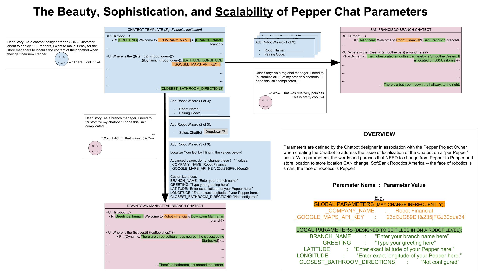</a>
Click ↑ to open an enlarged view!

### PARAMETERS - Global vs. Local

Parameters are essentially variables that you can set from within the Pepper Chat CMS and can be used throughout your chatbot. They are very powerful, and can be used to create  localized experiences on a per robot level.

So how does one employ the use of parameters within a chatbot?

Generally, the steps are to first decide what areas of the chatbot to localize. Then, create names for those placeholders called GLOBAL parameters. Their values should simply be tooltips to describe what should fill that placeholder. Once the global parameters for a chatbot have all been specified in the Pepper Chat CMS, then one can assign actual, localized values to a robot that will override the global parameter's tooltip value.

DETAILED STEPS:<br>
1.) First, when creating the chatbot for your company, think about all the areas of the chatbot that lend itself to having localized information. Replace the value in the chatbot with a descriptive name prefixed by '#local.' For example, let's say we want to customize Pepper's greeting on a per location basis. => If 'pepper_greeting' is the descriptive name we choose for the greeting, then in the chatbot we would specify '#local.pepper_greeting'<br>
2.) Then, in the Pepper Chat CMS on the Chatbot tab, click the icon to edit the parameters for the given chatbot (assuming it has already been added to the CMS) -- simply add the descriptive name from step 1, in this case just the text 'pepper_greeting' as a GLOBAL PARAMETER. For the value of the global parameter, put a text tooltip, i.e. 'This is where you put your greeting...'. Click save.<br>
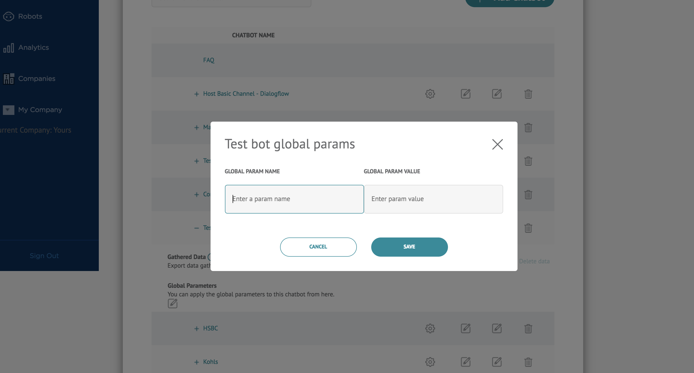

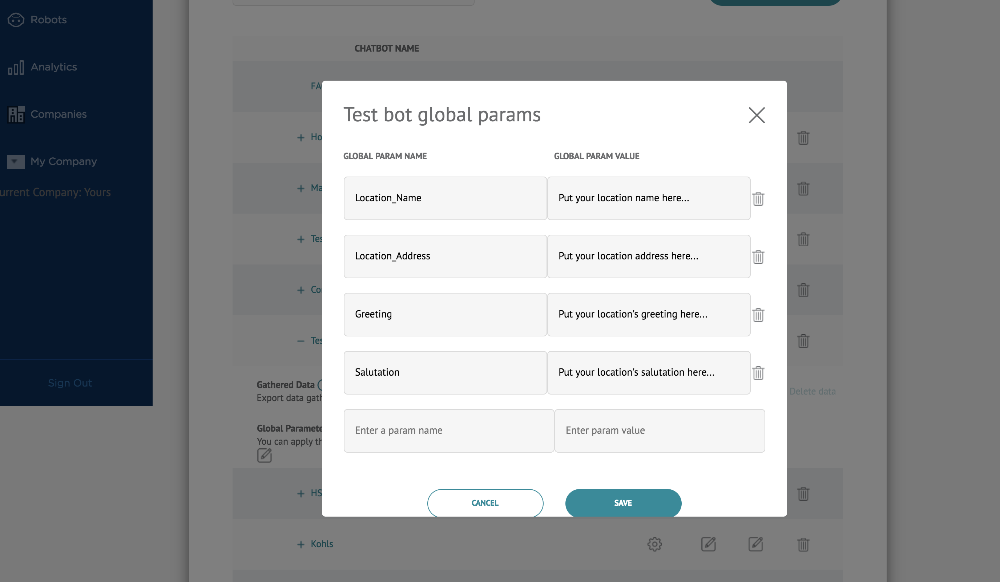

3.) Now, on the robots tab, select the robot for which you want to apply localized values for these parameters; click on the edit icon in order to provide the localized values.<br>
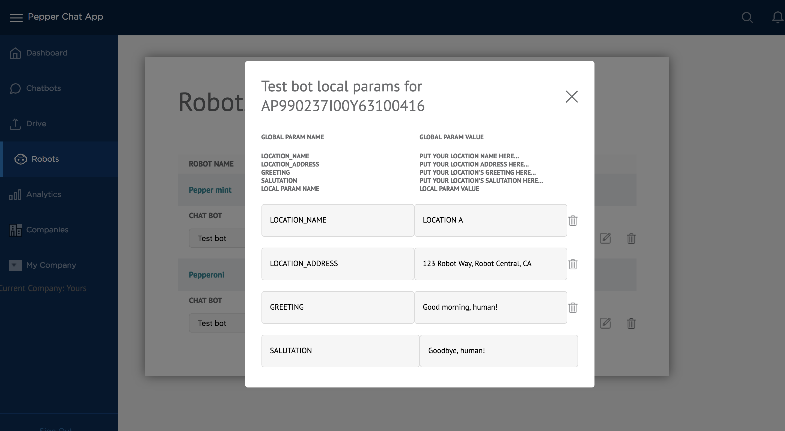

4.) Et voila! Your robot is now localized! You can also click on the hyperlink for the robot to test the localized values in the Pepper Simulator.<br>
<br>
Ex.) The following example shows how this might look in practice:<br>
 Pepper: #local.pepper_greeting and welcome to #local.location_name!<br>
              ↓  ↓  ↓  converts to  ↓  ↓  ↓ <br>
    Pepper: Hello, humans and welcome to our Manhattan branch!

# CONFIGURE YOUR CHATBOT

# → Attracting End Users

You can use the Pepper Chat CMS to create rules for what Pepper says and when to passersby. To use this advanced feature, it requires that the chatbot's Developer Access Key be provided to the Pepper Chat CMS. Use the builder to create rules for time of day and day of year.

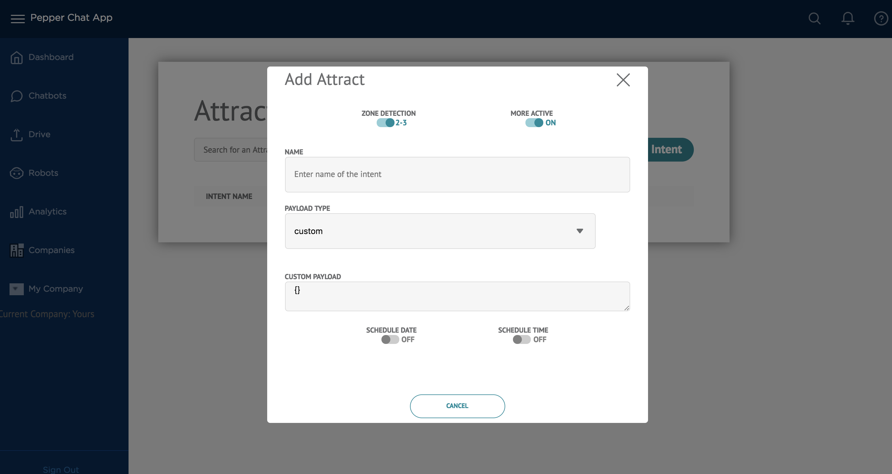

<aside type="info">NOTE: If the robot is set to "LESS ACTIVE" mode, please consider that your robot's speech engine will be disabled. Any speech you have in your custom attracts will not be spoken. </aside>

# TEST YOUR CHATBOT

# → The Pepper Simulator

Most of your robot's functionality can be tested virtually from within the Pepper Chat CMS via the Pepper Simulator. You can access the simulator by clicking on a chatbot that you have added. Please note that at this time, you have to manually toggle the Mute buttons throughout the conversation for the simulator to work as intended.

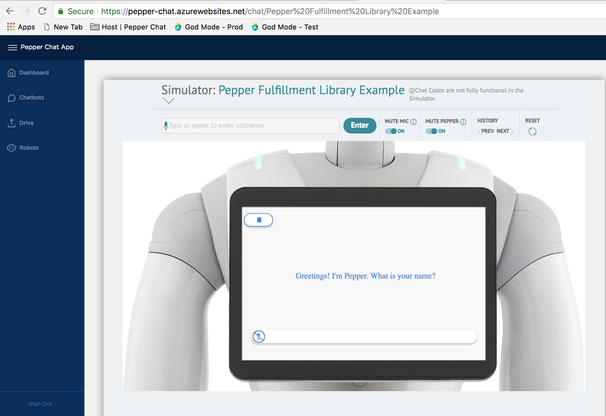

<aside type="info">NOTE: If you are using parameters for localization of your chatbot, you can test each localization by clicking on that localization from the Robot Page. </aside>

<aside type="warning">LIMITATIONS: The Pepper Simulator does not support any voice shaping commands at this time. Additionally, it also does not support animations, certain actions, certain click commands, etc.</aside>

<aside type="warning">PERFORMANCE DIFFERENCES: There are minor differences in performance between the simulator and your Pepper. To ensure an experience will actually work as expected on Pepper, please test your experience on an actual Pepper.</aside>
