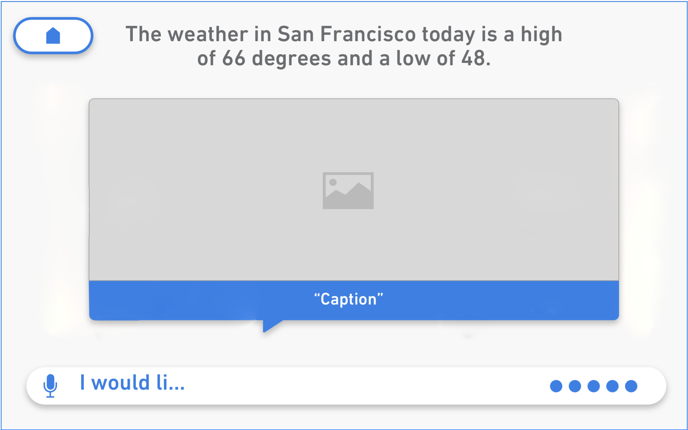
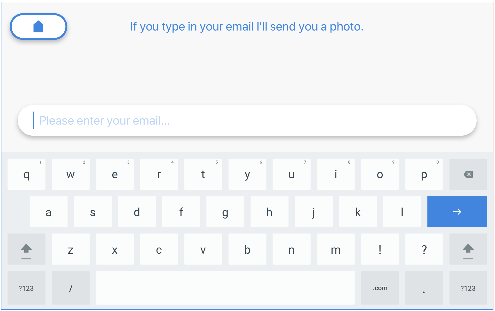

# Pepper ChatBot API
```dialogflow
"""""""""""""""""""""""""""""""""""""""""""""""""""""""""""""""""""""
DialogFlow (previously API.AI) is a popular chatbot platform. It's 
also Google's entry into the conversational agency space. Before 
Google acquired API.AI (and subsequently renamed it to Dialogflow), 
it was used primarily to allow developers to create voice interfaces 
for applications. Choose Dialogflow as an interface for Pepper to 
unlock your robot's latent conversational abilities.

To see a working example:
(1) Download the example .zip file here: 
https://github.com/SoftBankRoboticsTraining/pepper-dialogflow-chatbot-faq
(2) Create a free account at www.dialogflow.com;
(3) Create a new agent;
(4) Click the gear icon to access the agent's settings; 
(5) Select the 'Export and Import' tab;
(5) Upload the .zip file from Step 1.

For a quick tutorial: www.youtube.com/watch?v=B8PrcwENCJg

"""""""""""""""""""""""""""""""""""""""""""""""""""""""""""""""""""""
```


Welcome to the Pepper ChatBot API! You can use this API reference material to connect your 3rd party chatbot's endpoint to your Host account in order to integrate a new or existing chatbot with Pepper. 

You can view general integration instructions in this central, light blue section. In the dark area to the right, you can see chatbot-specific code examples corresponding visually in line with each general section. Switch between different chatbot-specific code examples with the tabs in the top right. 


```ms_bot_framework
"""""""""""""""""""""""""""""""""""""""""""""""""""""""""""""""""""""
The Microsoft Bot Framework facilitates the creation of 
powerful chatbots to enhance your application's capabilities. Its open 
source Bot Builder SDKs allow users to build simple to sophisticated 
dialogs. Cognitive Services enable your bot to interpret and interact 
in more human ways. The MS Bot Framework is one of the two 3rd-party 
chatbot integrations that Pepper for Host currently supports.

To see a working example, download the emulator here:
    https://docs.microsoft.com/en-us/bot-framework/bot-service-debug-emulator
and use the following sample PuppyBot information to set up your emulator:

MS Bot Endpoint:
   https://pepper-msbot.azurewebsites.net/api/messages?code=e3fa60oaOlabQUptT63DYSWPxrdG0pS9zFrADLT1xX9iGx6FxAG7pw==

PuppyBot App Id:
   808ad83e-3876-40fd-b0e8-a616e014fc6f

PuppyBot Password:
   9nHp8QNcwQJcNDHHjBCnoj7

PuppyBot LUIS Endpoint:
   https://westus.api.cognitive.microsoft.com/luis/v2.0/apps/4e4b1c46-5d6d-4035-9905-eef921df734f?subscription-key=37e463e0ae22427abc606d076dafbdd3&timezoneOffset=-480&verbose=true&spellCheck=true&q=

For the PuppyBot's source code and a list of sample utterances to ask 
the bot, navigate to our GitHub repo:
   https://github.com/SoftBankRoboticsTraining/msbot-puppy-bot/
"""""""""""""""""""""""""""""""""""""""""""""""""""""""""""""""""""""
```

<aside class="notice">We currently only support integrations with Microsoft's <a href="https://dev.botframework.com/"> Bot Framework</a> and Google's <a href="https://dialogflow.com/">Dialogflow</a>, but this list is quickly growing, so check back soon or else get in touch with us directly if your chatbot platform of choice does not appear on this list!</aside>


# Authentication & Setup


```ms_bot_framework
"""""""""""""""""""""""""""""""""""""""""""""""""""""""""""""""""""""""""
MS BOT FRAMEWORK SETUP INSTRUCTIONS:
For MS bots, setup consists of providing us with one of your bot's 
DirectLine 'Secret Keys'. Provide this key to the SBR Sales Engineer 
assisting you with setup. You can find it by following these steps:

Step 1: Open your bot in Azure portal (https://portal.azure.com).
Step 2: Select the CHANNELS tab.
Step 3: Add DirectLine to your bot.
Step 4: Click on Edit.
Step 5: Copy one of the Secret Keys that was generated.
Step 6: Give the copied value to the SBR Sales Engineer.
"""""""""""""""""""""""""""""""""""""""""""""""""""""""""""""""""""""""""
```

```dialogflow
"""""""""""""""""""""""""""""""""""""""""""""""""""""""""""""""""""""""""
DIALOGFLOW SETUP INSTRUCTIONS:
For Dialogflow bots, setup consists of providing us with your Client 
Access Token. Provide the token to the SBR Sales Engineer assisting you 
with setup. You can find your Client Access Token by following these steps:

Step 1: Open your bot in Dialogflow (https://console.dialogflow.com/)
Step 2: Click on the gear icon to the right of your selected agent.
Step 3: Under the General tab (default), copy the Client Access Token value.
Step 4: Give the copied value to the SBR Sales Engineer.

AGENT SETUP INSTRUCTIONS:
To setup a welcome intent on Pepper in your agent, set up a new intent 
with the text 'init1234' as the only utterance. You may use any type of 
response listed below for your welcome intent. You can also choose not to
have a welcome intent, although this is not recommended.
"""""""""""""""""""""""""""""""""""""""""""""""""""""""""""""""""""""""""
```
ChatBots use RESTful APIs with APP IDs, PASSWORDs, and/or ACCESS TOKENS to authenticate in order to send and retrieve text & multimedia session data. Requests are made to the ChatBot via a single endpoint:

<code>https://{YOUR-CHATBOT'S-ENDPOINT}</code>
<br><br><br>
SEE CHATBOT-SPECIFIC SETUP INSTRUCTIONS TO THE RIGHT → 

<aside class="notice">Authorization and setup varies between chatbots, but typically requires just providing us with an access token for identifying and authenticating your chatbot. We currently must work together (via <a href="tel:1-844‑737‑7371.">phone</a> or <a href="mailto:training@softbankrobotics.com">email</a>) with you or your developers to set this up, but we will soon provide a web interface for self service. </aside>


# Pepper Data Model

> Pepper Data Model - Pepper API returns the following data model, with its variations, in reply to an utterance or wav file sent through either POST or Websocket:

```json
{ 
    "utteranceId": GUID,
    "sessionId": GUID,
    "botConversationId": GUID,
    "response": STRING,
    "speak": STRING,
    "show": {
       "text": STRING,
        "content": [{
            "text": STRING,
            "speak": STRING,
            "contentURL": STRING URL,
            "value": STRING
        }]
    }
}
```

To the right, you can see the generic data model returned by the Pepper API. Below you can find definitions for the various datums returned in the response. In the sections that follow, you can see precisely how Pepper will display various types of mixed media responses.


### Definitions:

<code> utteranceId</code>

A GUID generated by Pepper in order to track the sent and returned values for an utterance.

<code> sessionId </code>

A GUID generated by Pepper in order to track the chat session, has a mapping to a botCoversationId if needed.

<code> botConversationId </code>

A GUID generated by the bot in the cloud. Satisfi let’s us set this, so it’s a one to one mapping in some cases.

<code> response </code>

The pre-parsed response string that is used to populate values for "speak" & "show.*"

<code> speak </code>

A string Pepper is meant to speak upon RETURN of the data model from the WebSocket

<code> show </code>

An object detailing out what Pepper is supposed to show, along with actionable entities

<code> show.text </code>

A string that Pepper is supposed to show as a title for the content to be displayed

<code> show.content </code>

A object that contains an array of objects meant to cover all scenarios related to chatbot interfaces.

<code> show.content.text </code>

A nullable string to be shown for the content object

<code> show.content.speak </code>

A nullable string for Pepper to speak upon selection of the content object

<code> show.content.contentURL </code>

The nullable url for the content to be displayed of the content object

<code> show.content.value </code>

A nullable string that contains the actionable value to be returned to the chat bot upon content selection.

## General Information

> GENERAL INFORMATION:

```dialogflow
"""""""""""""""""""""""""""""""""""""""""
Dialogflow:
""""""""""""""""""""""""""""""""""""""""
I.) SPEAKING TEXT VS DISPLAYING TEXT:
By default, Pepper will both speak and display whatever text you 
write in these fields. That is oftentimes not desirable behavior;
for any display section below, to have Pepper say one thing and 
display another, use double pipes (||), following this syntax:

{What Pepper Says} || {What Pepper displays on the tablet}

Ex. Hello, human || Hello
In this example, Pepper will say 'Hello, human' while only displaying
'Hello'.

Note that in the section of what Pepper says, QiChat is allowed:
http://doc.aldebaran.com/2-5/naoqi/interaction/dialog/dialog-syntax_full.html#

Here are some useful QiChat commands:

Speech*:
\pau=1000\ = Inserts a pause (in milliseconds)
\rspd=100\ = Speed of voice (in percentage, 50-400)
\vct=100\ = Pitch of voice (in percentage, 50=200)
\vol=100\ = Volume of voice (in percentage, 0-100)
\style=joyful\ = Joyful intonation
\style=neutral\ = Normal intonation
\style=didactic\ = Didactic intonation
\rst\ = Resets control sequences

Animations/Dances/Games:
^run(animation_full_name**) = Animates Pepper w/ a given animation
^start(animation_full_name**) = Animates Pepper w/ a given animation,
while also continuing to speak whatever follows the command
^run(app-id/behavior_name)*** = Activates a given game/dance/etc

* When using JSON syntax (Custom Payloads, etc.), QiChat commands must be double-escaped (\\).

** For a list of available animations, go here: 
http://doc.aldebaran.com/2-5/naoqi/motion/alanimationplayer-advanced.html#animationplayer-list-behaviors-pepper

*** This feature is still in BETA. More documentation will be available when it is ready.

II.) FULFILLMENT
In each section below, the JSON mappings between Dialogflow's response body and the Pepper
Chatbot API are provided. Use the standard, Google-provided Dialogflow library to build
responses.
```


## Text Only Response

> TEXT ONLY RESPONSE:

```dialogflow
"""""""""""""""""""""""""""""""""""""""""
Dialogflow:
""""""""""""""""""""""""""""""""""""""""
I.) UI:
For each intent within your agent, use the simple 'Text response'
fields under the 'Response' section to render a response. Input multiple
responses to have Pepper randomly choose between text responses. See 
'General Information' section above for information on how to have Pepper
display different text from what he speaks.

II.) Fulfillment / Webhook:
JSON MAPPING: (Dialogflow --> Pepper Data Model)
  'result.fulfillment.messages.textToSpeech' --> 'response',
---------------------------------------
Sample Dialogflow Response:
{
  'id': '864d0f29-97ee-4679-9ed3-7ad8bf854328',
  'timestamp': '2017-11-30T22:23:11.986Z',
  'lang': 'en',
  'result': {
    'source': 'agent',
    'resolvedQuery': 'are you a real cowboy',
    'action': '',
    'actionIncomplete': false,
    'parameters': {},
    'contexts': [],
    'metadata': {
      'intentId': '8bdca811-cf6f-4f0b-8e69-4c2391ecaea1',
      'webhookUsed': 'false',
      'webhookForSlotFillingUsed': 'false',
      'intentName': 'are you a real cowboy'
    },
    'fulfillment': {
      'speech': 'What else would I be partner? Cowboy noises!',
      'messages': [
        {
          'type': 'simple_response',
          'platform': 'google',
          'textToSpeech': 'What else would I be partner?  Cowboy noises!'
        }
      ]
    },
    'score': 1
  },
  'status': {
    'code': 200,
    'errorType': 'success',
    'webhookTimedOut': false
  },
  'sessionId': '4aee6997-b8d6-4e3f-9781-d9011adbee0d'

```


```ms_bot_framework
"""""""""""""""""""""""""""""""""""""""""
MS-Bot: Text Only response:
"""""""""""""""""""""""""""""""""""""""""
{
  "type": "message",
  "text": "Duh, German Shepard Puppies tell the best jokes!",
  "locale": "en-US",
  "localTimestamp": "2017-10-02T11:11:52-07:00",
  "from": {
    "id": "default-bot",
    "name": "Bot"
  },
  "recipient": {
    "id": "default-user"
  },
  "inputHint": "acceptingInput",
  "replyToId": "9hecj33gj8mckk1m3",
  "id": "48mj8inig8dmc9i39",
  "channelId": "emulator",
  "timestamp": "2017-10-02T18:11:52.982Z",
  "conversation": {
    "id": "mb6c0bcdl2eclij9i"
  }
}

"""""""""""""MAPPING""""""""""""""""""""
Mapping (MS-Bot -> Pepper Data Model):
text -> speak
text -> show.text

WHERE
-> = strictly mapped
""""""""""""""""""""""""""""""""""""""""
```


##  Video Response

> VIDEO RESPONSE:

```dialogflow
"""""""""""""""""""""""""""""""""""""""""
Dialogflow: 
""""""""""""""""""""""""""""""""""""""""
I.) UI:
For a given intent within your agent, under the 'Response'
section, click 'Add Message Content', select 'Custom Payload'
and copy and paste the following:
{
  "videoURL": "https://url-of-your-video-file.mp4",
  "contentType": "video/mp4",
  "speak": "Here is a short video that is relevant to your utterance..."
}

Note: When using JSON (^^), any QiChat commands must be double-escaped (\\).

II.) Fulfillment / Webhook:

JSON MAPPING (Dialogflow --> Pepper Data Model)
  'result.fulfillment.messages[0].payload.speak' --> 'response',
  'result.fulfillment.messages[0].payload.videoURL' --> 'show.content[0].contentURL',
  'result.fulfillment.messages[0].payload.contentType' --> 'show.content[0].contentType'
  ...
  'result.fulfillment.speech' --> 'response',
-----------------------
Sample Dialogflow Response:
{
  'id': '6dd173bd-dc9d-485c-9ed1-3354985ffb08',
  'timestamp': '2017-12-29T19:39:41.413Z',
  'lang': 'en',
  'result': {
    'source': 'agent',
    'resolvedQuery': 'play a story',
    'action': '',
    'actionIncomplete': false,
    'parameters': {},
    'contexts': [
      {
        'name': 'no_choice',
        'parameters': {},
        'lifespan': 5
      }
    ],
    'metadata': {
      'intentId': '32898728-063c-45e4-9d8f-e01a3277f1a3',
      'webhookUsed': 'false',
      'webhookForSlotFillingUsed': 'false',
      'intentName': 'company story'
    },
    'fulfillment': {
      'speech': 'What would you like to do now?||I'm Pepper',
      'messages': [
        {
          'type': 4,
          'payload': {
            'videoURL': 'https://pepperstoragedev.blob.core.windows.net/files/fortressVideo.mp4',
            'contentType': 'video/mp4',
            'speak': 'Here is a short video about a company who uses pepper'
          }
        }
      ]
    },
    'score': 1
  },
  'status': {
    'code': 200,
    'errorType': 'success',
    'webhookTimedOut': false
  },
  'sessionId': '377379ef-b675-4482-a787-76f6db4750a5'
}
```


```ms_bot_framework
"""""""""""""""""""""""""""""""""""""""""
MS-Bot: Video Only response:
"""""""""""""""""""""""""""""""""""""""""
{
  "type": "message",
  "attachments": [{
    "contentUrl": "https://pepperstoragedev.blob.core.windows.net/pepperstories/b68b2247-f74a-4f6b-b3ad-3e7e66c1e600.mp4?decache=QLT1MXCSF1A9",
    "contentType": "video/mp4",
    "name": "Puppy video"
  }],
  "text": "Here is a puppy video",
  "locale": "en-US",
  "localTimestamp": "2017-10-02T11:09:03-07:00",
  "from": {
    "id": "default-bot",
    "name": "Bot"
  },
  "recipient": {
    "id": "default-user"
  },
  "inputHint": "acceptingInput",
  "replyToId": "f0igi03ln2f4fem94c",
  "id": "ek9im8g5df0e305bf",
  "channelId": "emulator",
  "timestamp": "2017-10-02T18:09:03.318Z",
  "conversation": {
    "id": "mb6c0bcdl2eclij9i"
  }
}

"""""""""""""MAPPING""""""""""""""""""""
Mapping (MS-Bot -> Pepper Data Model):
attachments ~> show.content
attachments.contentUrl-> show.content. contentURL
attachments.contentType-> show.content.contentType
text -> speak
text -> show.text

WHERE
~> = loosely mapped
-> = strictly mapped
""""""""""""""""""""""""""""""""""""""""
```

## Non-Actionable Full Screen Image Response

> NON-ACTIONABLE FULL SCREEN IMAGE RESPONSE:

```dialogflow
"""""""""""""""""""""""""""""""""""""""""
Dialogflow: 
""""""""""""""""""""""""""""""""""""""""
I.) UI:
For a given intent within your agent, under the 'Response'
section, click 'Add Message Content', select 'Custom Payload' 
and copy and paste the following:
{
  "imageURL": "https://url-of-your-image-file.jpg",
  "speak": "Look at this beautiful image that is relevant to your utterance..."
}

Notes: 

A) With non-actionable images, it is recommended to keep the conversation
alive with a follow-up message. To prompt the user for another action, 
simply combine the Basic Card with the Google Assistant Suggestion Chips.

B) When using JSON (^^), any QiChat commands must be double-escaped (\\).


II.) Fulfillment / Webhook:

JSON MAPPING (Dialogflow --> Pepper Data Model):
  'result.fulfillment.messages[0].payload.speak': 'response',
  'result.fulfillment.messages[0].payload.imageURL': 'show.content[0].contentURL'
-----------------------------
Sample Dialogflow Response:
{
  'id': '537af1ac-5bfd-4839-a279-7574af79bb3c',
  'timestamp': '2017-12-29T19:32:31.544Z',
  'lang': 'en',
  'result': {
    'source': 'agent',
    'resolvedQuery': 'play a story',
    'action': '',
    'actionIncomplete': false,
    'parameters': {},
    'contexts': [
      {
        'name': 'no_choice',
        'parameters': {},
        'lifespan': 5
      }
    ],
    'metadata': {
      'intentId': '32898728-063c-45e4-9d8f-e01a3277f1a3',
      'webhookUsed': 'false',
      'webhookForSlotFillingUsed': 'false',
      'intentName': 'company story'
    },
    'fulfillment': {
      'speech': 'What would you like to do now?||I'm Pepper',
      'messages': [
        {
          'type': 4,
          'payload': {
            'imageURL': 'https://pepperstoragedev.blob.core.windows.net/files/Default_Story_1.jpg',
            'speak': 'Hi, I dont know how much you know about me, but I am here to be your host.||'
          }
        }
      ]
    },
    'score': 1
  },
  'status': {
    'code': 200,
    'errorType': 'success',
    'webhookTimedOut': false
  },
  'sessionId': '377379ef-b675-4482-a787-76f6db4750a5'
}

```


```ms_bot_framework
"""""""""""""""""""""""""""""""""""""""""
MS-Bot: Full Screen Image response:
""""""""""""""""""""""""""""""""""""""""

Not yet available in MS-Bot
```

## Non-Actionable Image and Text Response

> NON-ACTIONABLE IMAGE & TEXT RESPONSE:

```dialogflow
"""""""""""""""""""""""""""""""""""""""""""""""""""""""""""
Dialogflow: Non-actionable Images (with follow-up buttons)
""""""""""""""""""""""""""""""""""""""""""""""""""""""""""
I.) UI:
For a given intent within your agent, under the 'Response'
section:
1) Click the + icon next to 'Default'
2) Select 'Google Assistant'
3) Under the 'Google Assistant' tab, select 'Add Message Content'
4) Select 'Basic Card'
5) Enter the URL of the picture
6) In the 'Title' field, enter what you want Pepper to say and display
on its tablet according to the syntax described above ^^ in the 
'General Information' section: ({What Pepper Says} || {What Pepper displays})

Note: with non-actionable images, it is recommended to keep the conversation
alive with a follow-up message. To prompt the user for another action, 
simply combine the Basic Card with the Google Assistant Suggestion Chips.

II.) Fulfillment / Webhook:

JSON MAPPING (Dialogflow --> Pepper Data Model):
    'result.fulfillment.messages.title': 'response',
    'result.fulfillment.messages.image.url': 'show.content[].contentURL'
------------------------
Sample Response:
{
  'id': '3cdeb23e-0a11-4f7e-b4ce-329d690d2bd0',
  'timestamp': '2017-11-30T22:10:37.922Z',
  'lang': 'en',
  'result': {
    'source': 'agent',
    'resolvedQuery': 'show a picture',
    'action': '',
    'actionIncomplete': false,
    'parameters': {},
    'contexts': [],
    'metadata': {
      'intentId': 'e497c94b-85be-4d59-a31c-4e5e34da8ba4',
      'webhookUsed': 'false',
      'webhookForSlotFillingUsed': 'false',
      'intentName': 'Show a picture'
    },
    'fulfillment': {
      'speech': '',
      'messages': [
        {
          'type': 'basic_card',
          'platform': 'google',
          'title': 'This is not a cowboy',
          'image': {
            'url': 'https://peopledotcom.files.wordpress.com/2016/12/tigers-1.jpg?w=2000&h=1333'
          },
          'buttons': []
        },
        {
          'type': 'suggestion_chips',
          'platform': 'google',
          'suggestions': [
            {
              'title': 'Show two pictures'
            }
          ]
        }
      ]
    },
    'score': 1
  },
  'status': {
    'code': 200,
    'errorType': 'success',
    'webhookTimedOut': false
  },
  'sessionId': '4aee6997-b8d6-4e3f-9781-d9011adbee0d'
}
```



```ms_bot_framework
"""""""""""""""""""""""""""""""""""""""""
MS-Bot: Image Attachments response:
"""""""""""""""""""""""""""""""""""""""""
{
  "type": "message",
  "attachments": [{
      "contentUrl": "http://www.greathillpartners.com/wp-content/uploads/Golden-Puppy.jpg",
      "contentType": "image/jpg",
      "name": "Puppy pic 1"
    },
    {
      "contentUrl": "https://i.ytimg.com/vi/VRiWE1l8KqI/maxresdefault.jpg",
      "contentType": "image/jpg",
      "name": "Puppy pic 2"
    },
    {
      "contentUrl": "http://24.media.tumblr.com/53e3171e750c6c1028f8200ad73c8a53/tumblr_mkozt0qp3B1qiwf8po1_500.jpg",
      "contentType": "image/jpg",
      "name": "Puppy pic 1"
    }
  ],
  "text": "Here are some puppies",
  "locale": "en-US",
  "localTimestamp": "2017-10-02T11:01:51-07:00",
  "from": {
    "id": "default-bot",
    "name": "Bot"
  },
  "recipient": {
    "id": "default-user"
  },
  "inputHint": "ignoringInput",
  "replyToId": "3j6714mfbl49hf1bac",
  "id": "688k3bd50e8ifk364c",
  "channelId": "emulator",
  "timestamp": "2017-10-02T18:01:51.235Z",
  "conversation": {
    "id": "efj6c25bj3e43b0c9"
  }
}

"""""""""""""MAPPING""""""""""""""""""""
Mapping (MS-Bot -> Pepper Data Model):
attachments ~> show.content
attachments.contentUrl-> show.content.contentURL
attachments.contentType-> show.content.contentType
text -> speak
text -> show.text

WHERE
~> = loosely mapped
-> = strictly mapped
""""""""""""""""""""""""""""""""""""""""
```

## Non-Actionable Images Only Response

> NON-ACTIONABLE IMAGES ONLY RESPONSE:

```dialogflow
"""""""""""""""""""""""""""""""""""""""""
Dialogflow:
""""""""""""""""""""""""""""""""""""""""
To create a non-actionable sequence of (full screen) images, use the
'Full Screen Image Response' described above. Chain the Custom
Payloads together, one after another, to create a story.
```


```ms_bot_framework
"""""""""""""""""""""""""""""""""""""""""
MS-Bot: Image Attachments response:
"""""""""""""""""""""""""""""""""""""""""
{
  "type": "message",
  "attachments": [{
      "contentUrl": "http://www.greathillpartners.com/wp-content/uploads/Golden-Puppy.jpg",
      "contentType": "image/jpg",
      "name": "Puppy pic 1"
    },
    {
      "contentUrl": "https://i.ytimg.com/vi/VRiWE1l8KqI/maxresdefault.jpg",
      "contentType": "image/jpg",
      "name": "Puppy pic 2"
    },
    {
      "contentUrl": "http://24.media.tumblr.com/53e3171e750c6c1028f8200ad73c8a53/tumblr_mkozt0qp3B1qiwf8po1_500.jpg",
      "contentType": "image/jpg",
      "name": "Puppy pic 1"
    }
  ],
  "text": "Here are some puppies",
  "locale": "en-US",
  "localTimestamp": "2017-10-02T11:01:51-07:00",
  "from": {
    "id": "default-bot",
    "name": "Bot"
  },
  "recipient": {
    "id": "default-user"
  },
  "inputHint": "ignoringInput",
  "replyToId": "3j6714mfbl49hf1bac",
  "id": "688k3bd50e8ifk364c",
  "channelId": "emulator",
  "timestamp": "2017-10-02T18:01:51.235Z",
  "conversation": {
    "id": "efj6c25bj3e43b0c9"
  }
}

"""""""""""""MAPPING""""""""""""""""""""
Mapping (MS-Bot -> Pepper Data Model):
attachments ~> show.content
attachments.contentUrl-> show.content.contentURL
attachments.contentType-> show.content.contentType
text -> speak
text -> show.text

WHERE
~> = loosely mapped
-> = strictly mapped
""""""""""""""""""""""""""""""""""""""""
```


## Actionable Images & Text Response

> ACTIONABLE IMAGES & TEXT RESPONSE:

```dialogflow
"""""""""""""""""""""""""""""""""""""""""
Dialogflow:
""""""""""""""""""""""""""""""""""""""""
I.) UI:
For a given intent within your agent, under the 'Response'
section:
1) Click the + icon next to 'Default'
2) Select 'Google Assistant'
3) Under the 'Google Assistant' tab, select 'Add Message Content'
4) Select 'List'
5) Enter the URL of the picture
6) In the Title field, enter what you want Pepper to say and display
on its tablet according to the syntax described above ^^ in the 
'General Information' ({What Pepper Says} || {What Pepper displays})
7) In the field that says 'Enter option key...', enter a specific 
line of text that will trigger another custom intent that you will 
need to create to receive the action
8) Add as many list items as you want displayed

II.) Fulfillment / Webhook:

JSON MAPPING (Dialogflow --> Pepper Data Model):
    'result.fulfillment.messages.title': 'response',
    'result.fulfillment.messages.items[N].title': 'show.content[N].text',
    'result.fulfillment.messages.items[N].optionInfo.key': 'show.content[N].value',
    'result.fulfillment.messages.items[N].image.url': 'show.content[N].contentURL',
----------------------
{
  'id': 'ffd97ee7-c3de-4969-838d-9b5cc4fc2355',
  'timestamp': '2017-11-30T22:02:59.403Z',
  'lang': 'en',
  'result': {
    'source': 'agent',
    'resolvedQuery': 'show three images',
    'action': '',
    'actionIncomplete': false,
    'parameters': {},
    'contexts': [],
    'metadata': {
      'intentId': '02707fd4-7a1c-49ac-9558-99cc833486ed',
      'webhookUsed': 'false',
      'webhookForSlotFillingUsed': 'false',
      'intentName': 'Three Pictures'
    },
    'fulfillment': {
      'speech': '',
      'messages': [
        {
          'type': 'list_card',
          'platform': 'google',
          'title': 'Boy howdy, some more pictures ya cow rustler ya!',
          'items': [
            {
              'optionInfo': {
                'key': 'Show four pictures',
                'synonyms': []
              },
              'title': 'Howdeedodat',
              'image': {
                'url': 'https://vignette.wikia.nocookie.net/simpsonstappedout/images/1/1c/Cowboy_Homer_Unlock.png/revision/latest?cb=20160426191603'
              }
            },
            {
              'optionInfo': {
                'key': 'Show four pictures',
                'synonyms': []
              },
              'title': 'Hot dawg!',
              'image': {
                'url': 'https://vignette.wikia.nocookie.net/hayday/images/8/89/Cowboy.png/revision/latest?cb=20150714092041'
              }
            },
            {
              'optionInfo': {
                'key': 'Show four pictures',
                'synonyms': []
              },
              'title': 'Cows and Horses and...and goats!',
              'image': {
                'url': 'https://vignette.wikia.nocookie.net/legomessageboards/images/0/06/Cowboy.PNG/revision/latest?cb=20130510190908'
              }
            }
          ]
        },
        {
          'type': 0,
          'speech': ''
        }
      ]
    },
    'score': 1
  },
  'status': {
    'code': 200,
    'errorType': 'success',
    'webhookTimedOut': false
  },
  'sessionId': '4aee6997-b8d6-4e3f-9781-d9011adbee0d'
}
```


```ms_bot_framework
"""""""""""""""""""""""""""""""""""""""""
MS-Bot: Hero Card with Images and Choices
"""""""""""""""""""""""""""""""""""""""""
{
  "type": "message",
  "attachmentLayout": "carousel",
  "attachments": [{
      "contentType": "application/vnd.microsoft.card.thumbnail",
      "content": {
        "title": "Boxer",
        "subtitle": "A breed of utility dog.",
        "text": "The American boxer is a stocky, well built, strong-looking dog, with a large head and a muscular build. Its coat is short and generally smooth. The breed is a light to moderate shedder.",
        "images": [{
          "url": "https://static.pexels.com/photos/158682/snow-dog-de-bordeaux-158682.jpeg"
        }],
        "buttons": [{
          "type": "imBack",
          "value": "boxer",
          "title": "Boxer"
        }]
      }
    },
    {
      "contentType": "application/vnd.microsoft.card.thumbnail",
      "content": {
        "title": "Akita",
        "subtitle": "Continental Toy Spaniel",
        "text": "The Akita is a very intelligent and self-assured dog that has a very easy time learning new tricks. This dog can be sociable with children and strangers but is generally reserved around new people. ",
        "images": [{
          "url": "https://upload.wikimedia.org/wikipedia/commons/5/56/Papillon_Ears.jpg"
        }],
        "buttons": [{
          "type": "imBack",
          "value": "akita",
          "title": "Akita"
        }]
      }
    }
  ],
  "locale": "en-US",
  "localTimestamp": "2017-10-02T10:45:24-07:00",
  "from": {
    "id": "n5dm5eb6ldekh6a3",
    "name": "Bot"
  },
  "recipient": {
    "id": "default-user"
  },
  "inputHint": "acceptingInput",
  "replyToId": "dn58c2bfjd1089dkac",
  "id": "nbdk7b69eb0j9j69",
  "channelId": "emulator",
  "timestamp": "2017-10-02T17:45:24.902Z",
  "conversation": {
    "id": "6ja3le587mmjbc4c"
  }
}

"""""""""""""MAPPING""""""""""""""""""""
Mapping (MS-Bot -> Pepper Data Model):
attachments ~> show.content
attachments.title -> show.content.text
attachments.subtitle -> **ABANDONED**
attachments.text -> show.content.speak
attachments.images.url -> show.content.contentURL
attachments.buttons.value -> show.content.value

ADDED
speak: 'Tap or Say one of the following'
show.content.text: 'Tap or Say one of the following'

WHERE
~> = loosely mapped
-> = strictly mapped
""""""""""""""""""""""""""""""""""""""""
```


## Actionable Text Bubbles Response

> ACTIONABLE TEXT BUBBLES RESPONSE:

```dialogflow
"""""""""""""""""""""""""""""""""""""""""
Dialogflow:
""""""""""""""""""""""""""""""""""""""""
I.) UI: 
There are two ways to display Text Bubbles within Dialogflow:
  A.) Google Assistant > Suggestion Cards:
    Under the 'Response' section:
      1) Click the + icon next to 'Default'
      2) Select 'Google Assistant'
      3) Under the 'Google Assistant' tab, select 'Add Message 
      Content'
      4) Select 'Suggestion Card'
      5) Input suggestions, which become Text Bubbles
  B.) Google Assistant > List:
    Under the 'Response' section:
      1) Click the + icon next to 'Default'
      2) Select 'Google Assistant'
      3) Under the 'Google Assistant' tab, select 'Add Message 
      Content'
      4) Select 'List'
      5) In the Title field, enter what you want Pepper to say 
      and display on its tablet according to the syntax described 
      above ^^ in the 'General Information':
      ({What Pepper Says} || {What Pepper displays})
      6) In the field that says 'Enter option key...', enter a 
      specific line of text that will trigger another custom 
      intent that you will need to create to receive the action
      7) Add more list items, which will become more Text Bubbles

II.) Fulfillment / Webhook:


JSON MAPPING (Dialogflow --> Pepper Data Model):
  A.) Suggestion Cards:
  ----------------------
    'result.fulfillment.messages.speech': 'response',
    'result.fulfillment.messages.suggestions[N].title': 'show.content[N].text',
    'result.fulfillment.messages.suggestions[N].title': 'show.content[N].value'
  ----------------------
  Example Suggestion Card Dialogflow Response:
    {
    'id': 'ae62e529-9f13-4f99-b2ae-193e438c2e2d',
    'timestamp': '2017-11-30T22:18:20.389Z',
    'lang': 'en',
    'result': {
      'source': 'agent',
      'resolvedQuery': 'show one button',
      'action': '',
      'actionIncomplete': false,
      'parameters': {},
      'contexts': [],
      'metadata': {
        'intentId': 'd6fbe8a3-86f8-4431-9d3c-78b6a3bfa061',
        'webhookUsed': 'false',
        'webhookForSlotFillingUsed': 'false',
        'intentName': 'one button'
      },
      'fulfillment': {
        'speech': '',
        'messages': [
          {
            'type': 'suggestion_chips',
            'platform': 'google',
            'suggestions': [
              {
                'title': 'show me two buttons'
              }
            ]
          },
          {
            'type': 0,
            'speech': ''
          }
        ]
      },
      'score': 1
    },
    'status': {
      'code': 200,
      'errorType': 'success',
      'webhookTimedOut': false
    },
    'sessionId': '4aee6997-b8d6-4e3f-9781-d9011adbee0d'
  }
 B.) List:
 {See Images & Text Response (Actionable)}
```


```ms_bot_framework
"""""""""""""""""""""""""""""""""""""""""
MS-Bot: Hero Card with Choices
"""""""""""""""""""""""""""""""""""""""""
{
  "type": "message",
  "attachments": [{
    "contentType": "application/vnd.microsoft.card.hero",
    "content": {
      "title": "Do you want to know about Puppies?",
      "buttons": [{
          "type": "imBack",
          "value": "Yes please",
          "title": "Yes please"
        },
        {
          "type": "imBack",
          "value": "No thanks",
          "title": "No thanks"
        }
      ]
    }
  }],
  "locale": "en-US",
  "localTimestamp": "2017-10-02T10:45:19-07:00",
  "from": {
    "id": "n5dm5eb6ldekh6a3",
    "name": "Bot"
  },
  "recipient": {
    "id": "default-user"
  },
  "inputHint": "acceptingInput",
  "replyToId": "i0gn412d30ag423i",
  "id": "j2j8245c6b9m12n3i",
  "channelId": "emulator",
  "timestamp": "2017-10-02T17:45:19.923Z",
  "conversation": {
    "id": "6ja3le587mmjbc4c"
  }
}

"""""""""""""MAPPING""""""""""""""""""""
Mapping (MS-Bot Hero Card w/ Choices -> Pepper Data Model):
attachments.content.buttons ~> show.content
attachments.content.buttons.title -> show.content.text
attachments.content.buttons.value -> show.content.value
attachments.content.title -> show.text
attachments.content.title -> speak

WHERE
~> = loosely mapped
-> = strictly mapped
""""""""""""""""""""""""""""""""""""""""
```

## Actions - Show Keyboard

> ACTIONS - SHOW KEYBOARD:

```dialogflow
"""""""""""""""""""""""""""""""""""""""""
Dialogflow: 
""""""""""""""""""""""""""""""""""""""""
For a given intent within your agent, under the 'Response'
section, select 'Custom Payload' and enter the following:
{
  "speak": "Type your confirmation number using the keyboard."
  "action": "showKeyboard"
}
```



```ms_bot_framework
"""""""""""""""""""""""""""""""""""""""""
MS-Bot: Show Keyboard response:
""""""""""""""""""""""""""""""""""""""""

Not yet available in MS-Bot
```

## Actions - Play a Game

> ACTIONS - PLAY A GAME:

```dialogflow
"""""""""""""""""""""""""""""""""""""""""
Dialogflow: 
""""""""""""""""""""""""""""""""""""""""
I.) UI:
  A.) To initiate a specific game, under the 'Response' section, 
  select 'Custom Payload' and enter the following:
  {
    "speak": "Initiating selfie mode."
    "action": "playGame",
    "action_parameters": {
      "gameName": "Take a Selfie"
    }
  }

    Current Game Options:
    - 'Mindfulness Minute'
    - 'Freestyle dance'
    - 'Take a Selfie'
    - 'Music Boxes'
    - 'Arcadia dance'

  B.) To initiate a random game, under the 'Response' section, 
  select 'Custom Payload' and enter the following:
  { 
    "payloadType": "action",
    "action": "playRandomGame"
  }

II.) Fulfillment / Webhook:
  A. Specific Game:
  JSON MAPPING (Dialogflow --> Pepper Data Model):
      'result.payload.speak': 'response',
      'result.payload.action': 'action'
  ---------------------------
  Example Response:
  {
    'id': '70e6c70b-062c-4d97-ac7e-e32474a3271c',
    'timestamp': '2018-01-03T19:11:58.456Z',
    'lang': 'en',
    'result': {
      'source': 'agent',
      'resolvedQuery': 'i don't know',
      'action': 'input.unknown',
      'actionIncomplete': false,
      'parameters': {},
      'contexts': [
        {
          'name': 'no_choice',
          'parameters': {},
          'lifespan': 5
        },
        {
          'name': 'first_contact',
          'parameters': {},
          'lifespan': 5
        }
      ],
      'metadata': {
        'intentId': 'c7303ef3-9810-409a-9f91-a50662c74783',
        'webhookUsed': 'false',
        'webhookForSlotFillingUsed': 'false',
        'intentName': 'Third try to games'
      },
      'fulfillment': {
        'speech': 'And now we're done. Tell me what you want to try next||I'm Pepper',
        'messages': [
          {
            'type': 0,
            'speech': 'Let's try taking a selfie together.'
          },
          {
            'type': 4,
            'payload': {
              'speak': 'Playing selfie now now',
              'action': 'playGame',
              'action_parameters': {
                'gameName': 'Take a Selfie'
              }
            }
          },
          {
            'type': 0,
            'speech': 'And now we're done.  Tell me what you want to try next||I'm Pepper'
          }
        ]
      },
      'score': 1
    },
    'status': {
      'code': 200,
      'errorType': 'success',
      'webhookTimedOut': false
    },
    'sessionId': '677aebd9-0348-4182-bd94-bb7c644368d6'
  }

  B. Random Game:
  JSON MAPPING (Dialogflow --> Pepper Data Model):
      'result.payload.speak': 'response',
      'result.payload.action': 'action'
  ---------------------------
  Example Response:
  {
    'id': '0c2a1941-abf2-4397-8c0d-0dbf117192f6',
    'timestamp': '2018-01-03T19:03:37.829Z',
    'lang': 'en',
    'result': {
      'source': 'agent',
      'resolvedQuery': 'play a random game',
      'action': '',
      'actionIncomplete': false,
      'parameters': {},
      'contexts': [
        {
          'name': 'no_choice',
          'parameters': {},
          'lifespan': 5
        },
        {
          'name': 'first_contact',
          'parameters': {},
          'lifespan': 5
        }
      ],
      'metadata': {
        'intentId': '2400f9ca-a1b9-4b48-a392-7892cc603cee',
        'webhookUsed': 'false',
        'webhookForSlotFillingUsed': 'false',
        'intentName': 'games'
      },
      'fulfillment': {
        'speech': '',
        'messages': [
          {
            'type': 4,
            'payload': {
              'payloadType': 'action',
              'action': 'playRandomGame'
            }
          }
        ]
      },
      'score': 0.8399999737739563
    },
    'status': {
      'code': 200,
      'errorType': 'success',
      'webhookTimedOut': false
    },
    'sessionId': '677aebd9-0348-4182-bd94-bb7c644368d6'
  }
```


```ms_bot_framework
"""""""""""""""""""""""""""""""""""""""""
MS-Bot: Play a Game response:
""""""""""""""""""""""""""""""""""""""""

Not yet available in MS-Bot
```

